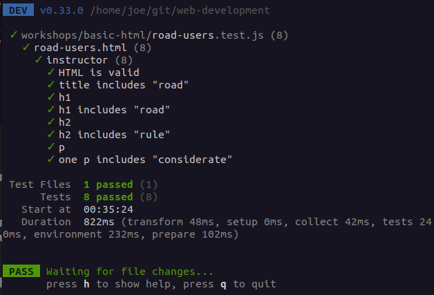

# Web Development and User Experience

This repository holds lecture notes, code examples, workshops, and
auto-markers for the corresponding MA module.

We try not to duplicate information here that you can get in Moodle.
Please check Moodle first each week, as we’ll send you back here if
needed.

## Getting started

Are you new to GitHub? You may find what you need in the [GitHub Documentation](https://docs.github.com/).

## Week 2
### Coding session 1 - Getting started with coding and HTML
#### [Markup and why computers need it](markup-and-why-computers-need-it.md)

> markup, computers vs. people, HTML

#### [HTML basics](html-basics.md)

> tag, element, `<`, `>`, `/`, `html`, `head`, `body`, `title`, `section`, `h1`, `h2`, `h3`, `p`, `em`, `strong`

#### [How the internet (really the web) works](how-the-internet-works.md)

> URL, `/`, scheme, host, path, browser tools, HTTP request and response

#### [Code editors and environments](code-editors-and-environments.md)

> code editor, development environment, running HTML code, file organization, inspecting code

#### [Workshop 1](workshop-1.md)

## Week 3
### Coding session 2 - Boosting HTML
#### [HTML attributes](html-attributes.md)

> variable, attribute, `=`, `"`, attribute name, attribute value, `lang`

#### [HTML links, images, and file organization](html-links-images-and-file-organization.md)

> images, links, `a`, `href`, `img`, `src`, `alt`, `width`, `height`, absolute vs. relative URL, URL fragment, file organization, `index.html`

#### [Behind-the-scenes HTML](behind-the-scenes-html.md)

> social media, search results, `head`, `meta`, `name`, `content`, `title`, `description`, `og:image`, `twitter:image`, character encoding, `charset`, `utf-8`, `style`, `src`, `link`, `rel`, `href`, `script`, `defer`, comments, `<!-- -->`, `hidden`

#### [Meaning and presentation in HTML](meaning-and-presentation-in-html.md)

> meaning, presentation, semantic HTML, HTML history, `table`, `br`, `p`, `strong`, `b`, `em`, `i`, `figure`, `img`, `figcaption`, `ul`, `ol`, `li`, `div`, `span`, `header`, `nav`, `main`, `aside`, `article`, `section`, `footer`

#### [Workshop 2](workshop-2.md)

## Week 8
### Coding session 5 - CSS boost 2

#### [Will it work? Using sandboxes to run code experiments](will-it-work-using-sandboxes-to-test-code.md)
> sandboxes

### Coding session 6 - Responsive Web Design

## Week 9
### Coding session 7 - HTML forms and page structures

#### [HTML forms](html-forms.md)
> HTTP request methods, `form`, `method`, `action`, `type`, `label`, `for`, `input`, `name`, `button`

#### [HTML page structures](html-page-structures.md)
> layouts, `body`, `header`, `nav`, `main`, `article`, `section`, `footer`, `ul`

#### [Using Git and GitHub with VS Code](using-git-and-github.md)
> Git, GitHub, code editor

#### [Workshop 7](workshop-7.md)

## Week 10
### Coding session 8 - CANCELLED

## Week 11
### Coding session 9 - Introduction to Programming with JavaScript

#### [JavaScript setup](javascript-setup.md)
> programming language, running JavaScript code, `console.log`, comments, `//`, `/* */`

#### [JavaScript values and data types](javascript-values-and-data-types.md)
> values, data types, strings, `'`, `"`, escaping, `\`, numbers, booleans, `true`, `false`, `undefined`, `null`, `typeof`

#### [JavaScript evaluation with operators](javascript-evaluation-with-operators.md)
> operators, `+`, `==`, `!=`, `<`, `>`, `-`, `/`, `*`

#### [Workshop 9](https://github.com/Birkbeck2/wdux2223-workshop-js-values)

## Running auto-markers (for lecturers)

The auto-markers are written using [Vitest](https://vitest.dev/),
a user-friendly unit test framework in JavaScript from the makers of
Vue.js.

The tests are located in their corresponding workshop files, and there’s
one `test-utils.js` module that helps you run the tests on any
number of example or student repositories found in `answers`
subfolders. The test utils expect this structure:

```
.
└─ workshops
   └─ basic-html
      ├─ basic-html-instructions.md
      ├─ road-users.test.js                       // first part of filename should match file to test
      └─ answers                                  // the contents of this folder are git-ignored
         ├─ web-development-basic-html-student1   // this can be a Git repository
         │  └─ road-users.html                    // this file will be tested
         ├─ web-development-basic-html-student2
         │  └─ road-users.html                    // this file will be tested too
         └─ web-development-basic-html-instructor // make an private/internal instructor repository
            │                                     // with correct answers, to test your tests
            └─ road-users.html                    // this file will be tested too
```

Here are all the instructor repositories:

- [web-development-basic-html-instructor](https://github.com/Birkbeck2/web-development-basic-html-instructor)

To run tests on all the matching files in `answers` subfolders, clone the repository, install dependencies, and run the test command:

```shell
npm install
npm run test
```

You should then see a summary in the terminal with the test results:



To run tests on [Gradescope](https://gradescope-autograders.readthedocs.io/en/latest/), you must upload a ZIP file containing the test files
and a shell script to install dependencies in an Ubuntu 22.04 environment.

## Rights

Lectures are copyright Birkbeck, University of London. Pictures and
workshop documents are copyright Birkbeck, University of London unless
otherwise stated where they are referenced in the lectures.

<a rel="license" href="http://creativecommons.org/licenses/by/4.0/"></a><br />This work is licensed under a <a rel="license" href="http://creativecommons.org/licenses/by/4.0/">Creative Commons Attribution 4.0 International License</a>.
