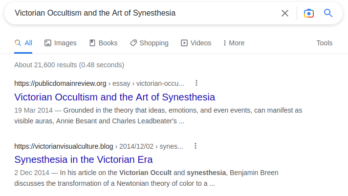
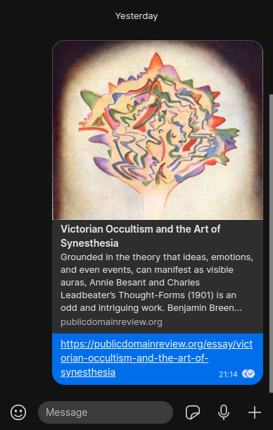
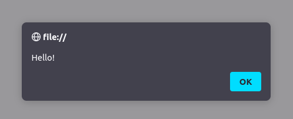

Web Development and User Experience | Coding Session 2 | Joseph Muller

[Previous](html-links-images-and-file-organization.md) | [All](README.md) | [Next](meaning-and-presentation-in-html.md)

# Behind-the-scenes HTML


_“Behind the scenes Photographer Levitation Magic [explore #496]” by Louish Pixel is licensed under [CC BY-NC-ND 2.0](https://creativecommons.org/licenses/by-nc-nd/2.0/?ref=openverse)._

Now that you know about attributes, you can see that a lot of the code in an HTML document never gets rendered. There's a lot that stays hidden, and works behind the scenes.

Let's dig into some more parts of HTML that are out of sight but should not be out of mind.

(Examples in this section use an [article on synesthesia by Benjamin Breen](#breen).)

## The head element

The `head` element is the first candidate for HTML that works behind the scenes.

```html
<!DOCTYPE html>
<html lang="en-GB">
    <head>
        <title>Victorian Occultism and the Art of Synesthesia</title>
    </head>
    <body>
    </body>
</html>
```

After the `title`, which you already know, you typically see a series of `meta` elements in the head. These stand for `metadata`, which is data about the document.

### Character set
Here's the first `meta` element to know about:

```html
<meta charset="utf-8">
```

(Note that `meta` is a self-closing tag--it doesn't wrap text, it's just there to hold the data in its main (“opening”) tag.)

This describes the character encoding of the document, which is about ones and zeros. When you are coding, you typically work in a world of plain text, but actually, the data is stored in rows of ones and zeros. Each one or zero is called a bit (a portmanteau of “binary digit”), and together they make up patterns that can express lots of different characters in human languages. The character encoding is how the computer translates between plain text and ones and zeros.

UTF-8 is the main worldwide character encoding standard that includes nearly all major human languages. You should generally always use UTF-8 encoding unless you have a very good reason to use something else. If you specify the wrong encoding, the document may come out garbled, because the computer has tried to decode it in the wrong way.

### Description



You can enter a description of your website that search engines will use in search results. Entering a good description using the key words from your page will dramatically enhance the search engine optimization (SEO) of your website.

 `https://publicdomainreview.org/essay/victorian-occultism-and-the-art-of-synesthesia`:

```html
<meta name="description" content="Grounded in the theory that ideas, emotions, and even events, can manifest as visible auras, Annie Besant and Charles Leadbeater’s <em>Thought-Forms</em> (1901) is an odd and intriguing work. Benjamin Breen explores these “synesthetic” abstractions and asks to what extent they, and the Victorian mysticism of which they were born, influenced the Modernist movement that flourished in the following decades.">
```

The description is entered using the `meta` element with two attributes, one for the name of the piece of metadata (`name`), and the other for the value (`content`).

### Social media images



You can tell social media websites and messenger apps what image to show when people link to your site.

You use the same `meta` element, but a slightly different set of attributes.

For Facebook and many others, you use `property` instead of `name` to give the name of the piece of metadata, because this convention came about through the development of a different standard than HTML, the [Open Graph protocol](https://ogp.me/).

You also include `og:` in the value of the `property` attribute to differentiate it from other standards that might use similar values. (This is called a _namespace._)

```html
<meta
    property="og:image"
    content="https://the-public-domain-review.imgix.net/essays/victorian-occultism-and-the-art-of-synesthesia/thoughtformsthumb.jpg"
    alt="Colorful drawn shapes ripple outward above a cathedral in a field"
>
```

For Twitter, you use `name` and `content`, but you include `twitter:` inside the value.
```html
<meta
    name="twitter:image"
    content="https://the-public-domain-review.imgix.net/essays/victorian-occultism-and-the-art-of-synesthesia/thoughtformsthumb.jpg"
    alt="Colorful drawn shapes ripple outward above a cathedral in a field"
>
```

As with any image, you include alt text.

As you can see, a lot of this code isn't behind the scenes at all, when your website goes live. In fact, in the case of the title, description, and social media photo, this might be the first thing that users will see when they encounter your content via a search or a share, so it's important not to forget about it.

### Style
Continuing our tour of the HTML `head`, you can include a `style` element as a wrapper for CSS code:

By the way, don't worry about CSS syntax right now. The CSS code below turns paragraphs red and puts `h2`s in a sans-serif font.

```html
<head>
    <style>
        p { color: red; }
        h2 { font-family: sans-serif; }
    </style>
</head>
<body>
    <h2>Autumn</h2>
    <p>Leaves are falling.</p>
</body>
```

But most of the time you will want to use another self-closing element, `link`, to import your CSS from a different file, so that you keep things organized and maintain the separation of content and style.

Files:

```
index.html
images/
    leaf.png
styles/
    main.css
```

In `index.html`:

```html
<head>
    <link rel="stylesheet" href="styles/main.css">
</head>
<body>
    <h2>Autumn</h2>
    <p>Leaves are falling.</p>
</body>
```

In `main.css`:

```css
p { color: red; }
h2 { font-family: sans-serif; }
```

These will both produce the same look and feel in the browser:


While we're on style, you need to know about one other way to include CSS in HTML. Instead of declaring it in the head, you include CSS code as the value of the `style` *attribute* of the element you're trying to style:

```html
<body>
    <h2 style="font-family: sans-serif;">Autumn</h2>
    <p style="color: red;">Leaves are falling.</p>
</body>
```

This is called in-line CSS. It is the easy-at-first, nightmarish-in-the-end way of doing CSS. It's nice when you only have two lines of HTML, because you don't have to save a separate file or use CSS selectors (i.e. element names).

But beware! You will regret it when your website gets bigger, or when you have to change the same CSS code on 16 different `div` tags, three separate times over the course of your project.

### Scripts

The `script` element works just like the `style` element, except it wraps *JavaScript* code.

```html
<head>
    <script>
        alert("Hello!");
    </script>
</head>
```

You can also import JavaScript from a separate file. But rather than use a `link` element like you do with CSS, you use `script` with a `src` attribute:

Files:

```
index.html
scripts/
    main.js
```

In `index.html`:

```html
<head>
    <script src="scripts/main.js" defer></script>
</head>
```

In `main.js`:

```js
alert("Hello!");
```

Note the `defer` attribute on the `script` element. This tells the browser to wait until all the HTML is loaded before running the JavaScript file, boosting performance.

(This attribute only requires its name (no `="some value"`) because it uses the Boolean data type (true or false).)

Here's what the JavaScript does when the page is loaded:



### Putting the head together

Here are all these elements put together.

```html
<!DOCTYPE html>
<html lang="en-GB">
    <head>
        <meta charset="utf-8">
        <title>The Seasons</title>
        <meta
            name="description"
            content="The seasons are described in terse, overly structured banalities"
        >
        <meta
            property="og:image"
            content="images/leaf-shed-in-autumn.png"
            alt="A light brown maple leaf spread out on a white background"
        >
        <meta
            name="twitter:image"
            content="images/leaf-shed-in-autumn.png"
            alt="A light brown maple leaf spread out on a white background"
        >
        <link rel="stylesheet" href="styles/main.css">
        <script src="scripts/main.js" defer></script>
    </head>
    <body>
        <h1>The seasons</h1>
        <section>
            <h2>Autumn</h2>
            <p>Leaves are falling.</p>
        </section>
    </body>
</html>
```

### Check your understanding
1. Where does content in your `meta` elements show up?
2. Would this work?
```html
<link src="stylesheet" content="styles/main.css">
```

<!--
1. Social media and search engine results
2. No. Link needs rel not src, and href not content
-->

## Hiding in the `body`

Not done being sneaky? There are ways to hide things in the `body` as well.

### Comments
As you write HTML code, you may need to write notes for yourself or other humans who will read it.

HTML provides a way to embed comments into your HTML files without rendering them in the browser.

```html
<h2>Autumn</h2>
<!-- Autumn is my favorite season, personally.
You can have a different favorite season,
if you want to be wrong. -->
<p>Leaves are falling.</p>
```

Comments open with a `<!--` and close with `-->`, and they can span multiple lines.

They are not rendered for the user, but they are visible in the code inspector.


### The `hidden` attribute

You can also just make things disappear with an attribute called `hidden`.

```html
<h2>Autumn</h2>
<p>Leaves are falling.</p>
<p hidden>Or disappearing.</p>
```

This one is useful for hiding elements at first until they are called up by user interactivity, or for including data in a web form.

Until you know how to do that, you may just find it useful to set some parts of your code to the side while you work on and test out other parts.

## References
“What's in the head? Metadata in HTML, Mozilla Developer Network, last modified October 4, 2022, [https://developer.mozilla.org/en-US/docs/Learn/HTML/Introduction_to_HTML/The_head_metadata_in_HTML](https://developer.mozilla.org/en-US/docs/Learn/HTML/Introduction_to_HTML/The_head_metadata_in_HTML).

<a name="breen"></a>Benjamin Breen, “Victorian Occultism and the Art of Synesthesia,” _The Public Domain Review_, March 19, 2014, [https://publicdomainreview.org/essay/victorian-occultism-and-the-art-of-synesthesia](https://publicdomainreview.org/essay/victorian-occultism-and-the-art-of-synesthesia).

## Rights
Copyright Birkbeck, University of London

<a rel="license" href="http://creativecommons.org/licenses/by/4.0/"></a><br />This work is licensed under a <a rel="license" href="http://creativecommons.org/licenses/by/4.0/">Creative Commons Attribution 4.0 International License</a>.
