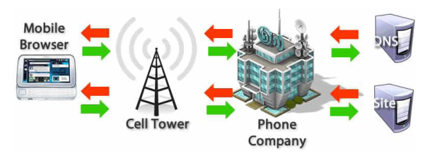
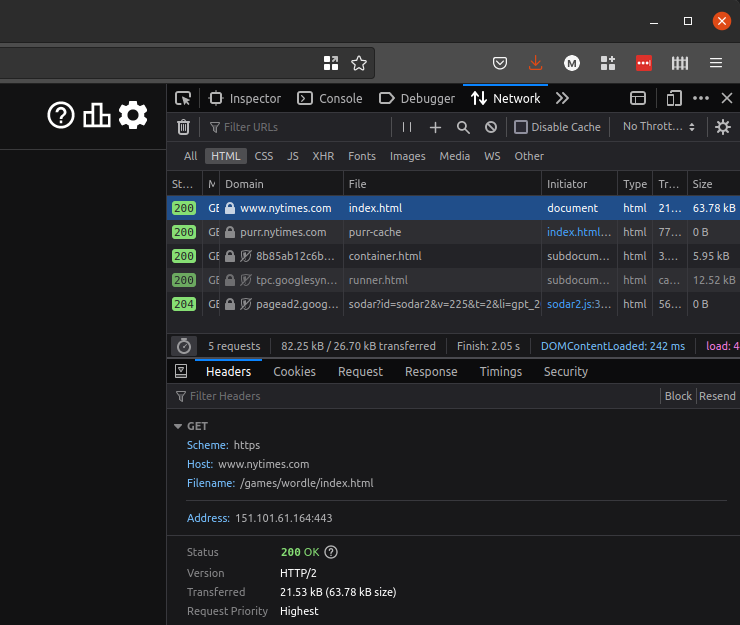

Web Development and User Experience | Coding Session 1 | Joseph Muller

[Previous](html_basics.md) | [All](README.md) | [Next](code_editors_and_environments.md)

# How the internet (actually the web) works


For many people, “the internet” is the entirety of every website, every social media feed, and every smart device's connectivity. It's a catch-all for the thing that has transformed societies and cultures in the last 30 years.

But if you want to be precise, [the internet is the underlying infrastructure](https://developer.mozilla.org/en-US/docs/Learn/Common_questions/How_does_the_Internet_work) for worldwide activity to happen between computers. It is a global network of computers, of hardware.

The activity that happens on top of the infrastructure is called the *world wide web*. The world wide web is the set of standards&mdash;the system of agreements or protocols&mdash;that makes it possible for signals to be exchanged and received in a way that machines can read them.

## URLs
Every time you load a website, your computer is participating in the world wide web as a *client*, requesting that another computer act as a *server* for that website.

### URL formation
Your computer starts by sending out a Uniform Resource Locator (URL) like this:

```
https://www.nytimes.com/games/wordle/index.html
\___/   \_____________/ \_____________________/ 
  |            |                   |
scheme       host                path
```

### Scheme
The *scheme* is the protocol to use. It answers the question “how?” Most of the time, in URLs coming from your computer, it's `https`, or “Hypertext Transfer Protocol Secure.”

### Host
The *host* is the name of the computer server that is responsible for the website. It answers the question “who?”

But at this stage, your computer still doesn't have a server. It's just a client with a request.

To understand the host name and to direct the client to the right server, your internet provider connects to a Domain Name System (DNS) server. The DNS server looks up the host on a public registry of host names and numerical addresses called Internet Protocol (IP) addresses. It then returns this server IP address so that you can connect to the actual server.

| host               | IP address     | :computer: DNS server |
| ------------------ | -------------- | --------------------- |
| www.nsa.gov        | 104.98.232.200 | :question:            |
| www.nytimes.com    | 151.101.61.164 | :white_check_mark:    |
| www.nzherald.co.nz | 62.253.3.225   |                       |


### Path
Last, the *path* tells the server which webpage you want from the server. It answers the question “what?” The server looks through its file structure and produces the right one:

    ```
    news/
       internet_invented.html
       teens_surf_the_web.html
    games/                               <--this one!
       crossword/
       wordle/                           <--then this one!
           past_wordles.html
           index.html                    <--and this one!
           other_wordle_thing.html
       checkers/
    videos/
       cats
       dogs
    ```

### Putting it together


Once the server has found the files that make up the webpage specified in the URL, it sends an HTTP response back to the client (your computer).

Your internet browser or app then processes the files to load them into a graphical or auditory representation for you to read, watch, or listen to.

### Check your understanding
1. When I'm scrolling an app like Instagram on my phone, is my phone using URLs?
2. If a host name has not been registered with an IP address in the DNS registry, can we use it on the web?
3. If there's a typo in the URL host name or path, will it still work?

## Browser tools
Your internet browser (Google Chrome, Mozilla Firefox, Microsoft Edge, Apple Safari) is a tremendous tool for web development. In addition to rendering websites, it can show you the code underneath the surface.

### Opening browser tools
Open your browser of choice, and find the developer tools. Here are instructions for [Chrome](https://developer.chrome.com/docs/devtools/open/), [Firefox](https://developer.mozilla.org/en-US/docs/Learn/Common_questions/What_are_browser_developer_tools), [Edge](https://learn.microsoft.com/en-us/microsoft-edge/devtools-guide-chromium/overview), and [Safari](https://support.apple.com/en-gb/guide/safari/sfri20948/mac).

### Watching network activity
Find the section related to Network activity. Type a URL into the browser bar and go.



You should see a flurry of HTTP requests and responses, with lots of technical information about each one.

Click into the one with the main path of your URL, view the “headers,” and you will see info related to the scheme, host, path, and resolved IP address.

### Inspecting the HTML response

The most valuable part of developer tools is the inspector pane. This lets you see the HTML document behind any website.

You can expand and collapse each level of the tree, or use the element picker to go right to the part of the code you want to look at.


### Editing the HTML response
Not only can you inspect any website, you can edit any website! Or at least, you can edit the version of any website that is loaded into your browser.

How is this possible? Remember that the server sends a version of the HTML document to your computer, and your computer downloads it before rendering it for your eyes and ears. So for the most part, once the page loads, what you see in the browser is not actually “out there,” it is on your computer. Until you interact with the page again in a way that calls another URL, the webpage will be separated from the server.

So, you can edit the local copy of the HTML document. Actions in Firefox include:
- dragging and dropping elements around the tree
- editing the text inside elements
- editing elements as HTML, allowing you to add new elements
- deleting elements

This is primarily useful for quickly testing out a potential change to your code to see how it will render. But it can also be fun to play around with existing websites!

### Check your understanding
1. If you turn off your internet after a page loads, will the content disappear?
2. What will happen if you use the inspector pane to drag an element in the `body` into the `head`?
3. If you edit something on the New York Times website using your developer tools, will they know? Will they come after you?


## Credits
Antonio Daniele created the precursor to this lecture for Birkbeck's MA in Digital Media Design in academic year 2021-22.

“URL,” Wikipedia, last upated 2022, https://en.wikipedia.org/wiki/URL.

“What are browser developer tools?,” Mozilla Developer Network, updated September 14, 2022, https://developer.mozilla.org/en-US/docs/Learn/Common_questions/What_are_browser_developer_tools

## Rights
Copyright Birkbeck, University of London

<a rel="license" href="http://creativecommons.org/licenses/by/4.0/"></a><br />This work is licensed under a <a rel="license" href="http://creativecommons.org/licenses/by/4.0/">Creative Commons Attribution 4.0 International License</a>.
