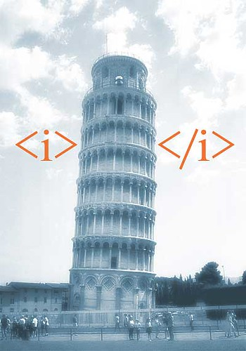
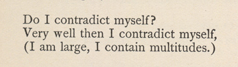

Web Development and User Experience | Coding Session 1 | Joseph Muller

[Previous](markup_and_why_computers_need_it.md) | [All](README.md) | [Next](how_the_internet_works.md)

# HTML basics



*"html tag italicized" by Jesper Rønn-Jensen is licensed under [CC BY-SA 2.0](https://creativecommons.org/licenses/by-sa/2.0/?ref=openverse)*

HTML stands for “HyperText Markup Language.”

The *hypertext* part basically refers to the ability to create links&mdash;we will come to that later.

The *markup language* part refers to the set of formally defined symbols and words that you can use to give precise instructions to computers about the structure and arrangement of text, images, video, and audio in a webpage.

The entire language only has a vocabulary of about 110 words. What is more, most of the time you will only be using 10 to 20 of those.

## Tags and elements
The most common thing in HTML is the *tag*. A *tag* always starts and ends with angle brackets.

```html
<>
```

And a tag always has a name. This can't just be any word&mdash;the name, including its spelling, has to match the HTML specification exactly. HTML names are case-insensitive, but most people write tag names with lowercase letters.

```html
<p>
```
  
Tags usually come in pairs, so that they can wrap or surround the thing that they describe or define. Closing tags must have a forward slash.

```html
<p>Leaves are falling.</p>
```
  
Together, two tags plus their content form an *element*.

```html
<p>Leaves are falling.</p>
```

Remember, the tags disappear when the page is rendered. This is what it looks like rendered:

<p>Leaves are falling.</p>

This is what it [sounds like read out loud by NVDA accessibility software (M4A)](media/leaves_are_falling.m4a)

## Common tags

When you are defining HTML tags, remember what American poet Walt Whitman said in *Leaves of Grass*:



The meaning of a tag is about what it contains, and some tags contain a lot.

| Tag (“My name is...”) | Meaning (“I contain...”) |
| --------------------- | ------------------------ |
`html` | an HTML document
`head` | information *about* the document that should not be rendered for the user, for the most part
`body` | the body of the HTML document, or in other words the main part of the document for rendering
`title` | the title of the document, usually meant to be displayed in the browser tab and on search engine results
`section` | a section of the document
`h1` | a level-1 heading, or in other words a bit of text that introduces what will follow
`h2` | a level-2 heading, or in other words a bit of text that introduces something to follow, but a smaller portion of the document than the level-1 heading
`p` | a paragraph of text
`em` | a bit of text that should be emphasized to the user, such as with italics

## Nesting

Most elements can contain other elements. This is called *nesting*.

```html
<body><h1>The seasons</h1><section><h2>Autumn</h2><p>Leaves are <em>falling</em>.</p></section><section><h2>Spring</h2><p>Leaves are <em>growing</em>.</p></section></body>
```

Yikes! That's hard to read. Let's add some human-friendly white space.

Most people use indentations and line breaks to visually represent the structure, even though computers don't need it.

```html
<body>
  <h1>The seasons</h1>
  <section>
    <h2>Autumn</h2>
    <p>Leaves are <em>falling</em>.</p>
  </section>
  <section>
    <h2>Spring</h2>
    <p>Leaves are <em>growing</em>.</p>
  </section>
</body>
```

Rendered HTML:

___

<body>
  <h1>The seasons</h1>
  <section>
    <h2>Autumn</h2>
    <p>Leaves are <em>falling</em>.</p>
  </section>
  <section>
    <h2>Spring</h2>
    <p>Leaves are <em>growing</em>.</p>
  </section>
</body>

___

Here are the things to notice about nesting:

1. Elements relate to each other as `parent` or `child` or `sibling` elements. So, in this HTML about the seasons, the first `section` is the child of `body`, the sibling of `h1` and the other `section`, and the parent of `h2` and `p`.

2. Elements have to close in the same sequence as they open.

    For example, this is not allowed:
    ```html
    <section>
      <p>
      </section>
    </p>
    ```

3. You can think of nested elements as forming a tree:

    ```
             h1         h2
            /          /
    body -- -- section -- p -- em
            \
             section -- h2
                     \
                      p -- em
    ```

## Required base structure

There is a lot of room for creativity with nesting, but HTML does require that all documents have the same over-arching structure.

```html
<!DOCTYPE html>
<html>
  <head>
    <title>Leaves</title>
  </head>
  <body>
  </body>
</html>
```

Things to notice about this basic structure:

1. Every HTML document must start with `<!DOCTYPE html>`. This looks different than most other HTML elements, because it is a legacy part of the language that identifies the file as HTML. You don't have to know much about it, just that you always put it on the first line.

2. The “root” of every HTML document is `html`, and it always has two branches, `head` and `body`.

3. The `head` element is not intended for display. It contains metadata (information about the document) and instructions for the browser on how to render the document.

4. You can put anything you want in the `body` element, though there are clear best practices.

## Check your understanding
1. Can you put an `html` element inside a `body` element?
2. Where does the `title` element appear in the browser?
3. If I use `para` instead of `p`, will the browser recognize it as a paragraph?

## Credits

Walt Whitman, “Song of Myself,” *Leaves of Grass* 51, https://whitmanarchive.org/published/LG/1891/poems/27.

“Introduction to HTML,” Mozilla Developer Network, last modified September 9, 2022, https://developer.mozilla.org/en-US/docs/Learn/HTML/Introduction_to_HTML.

*HTML: The Living Standard: Edition for Web Developers,* last updated September 28, 2022, https://html.spec.whatwg.org/dev/.

## Rights
Copyright Birkbeck, University of London

<a rel="license" href="http://creativecommons.org/licenses/by/4.0/"></a><br />This work is licensed under a <a rel="license" href="http://creativecommons.org/licenses/by/4.0/">Creative Commons Attribution 4.0 International License</a>.
