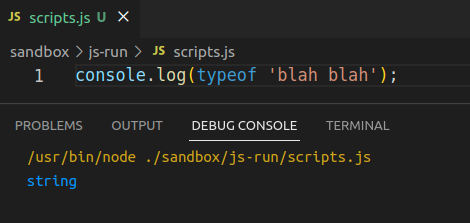

Web Development and User Experience | Coding Sessions | Joseph Muller

[Previous](javascript-setup.md) | [All](README.md) | [Next](javascript-evaluation-with-operators.md)

# JavaScript values and data types

To get started with JavaScript, let's learn about values and data types.

We've already learned about some *values* through HTML attributes and CSS rules.

In JavaScript, we need to learn these values a bit more carefully, because this is the main material that JavaScript runs on. Whereas HTML and CSS were focused on media like text and images, JavaScript is built from the ground up out of values, and the value types matter.

We refer to the types as *data types* because to JavaScript, all content, all values, are data.

## String values

Let's pick back up with `console.log('Hello');`. Why is `'Hello'` in quotation marks?

As a sequence of letters, the word "hello" is declared to JavaScript as a particular kind of thing, a *string*.

Strings are the first JavaScript data type to know about. A string can be nearly any sequence of letters, numbers, or unicode items.

These are all valid strings:

```js
'Hello'
"Hello"
'bbk.ac.uk'
"blue"
'Can I have a cup of coffee, please?'
"How do you say 'hello' in Korean?"
"200"
"d9fs0df9we0r235203n5235024923s9fsdf-sd9fw-9n23-r2n3f9-9SF-ZX9ZF2092N30FN20F9N"
"!P£$(&^)'£$(&^£!$P(!'FP(J!F)(£J!"
```

There are two basic rules for forming strings:

1. They must start and end with matching quotation marks, either single (`'`) or double (`"`). Without quotation marks, JavaScript will think the contents of the string are variable names, and we don't want that.

2. JavaScript uses the quotation marks to understand where the value starts and ends. So, strings cannot contain the quotation mark they start and end with, unless *escaped*. 

    What does this mean? Two things, in practice:

    - You can alternate the marks inside the string so that they are different from the start and end marks. For example, use double on the outside, and single on the inside, or vice versa:

        ```js
        "How do you say 'hello' in Korean?"
        'How do you say "hello" in Korean?'
        ```

    - You can use the same mark, but put a backslash (`\`) in front of it, so that it eludes or *escapes* the algorithm that JavaScript uses to figure out which things are strings:

        ```js
        "How do you say \"hello\" in Korean?"
        'How do you say \'hello\' in Korean?'
        ```

        What if you have a string that has a backslash in it? Escape it as well by putting another one in front of it:

        ```js
        "The files are located at C:\\Users\\Documents"
        ```

        JavaScript will interpret this as a valid string with a value of `The files are located at C:\Users\Documents`.

### Check your understanding

1. Can you make a string like this?

    ```js
    'Hello"
    ```

2. How many valid strings does this line have? Where do they start and end?

    ```js
    "There are many "ways" you can "interpret" things."
    ```

3. Is this a valid string?

    ```js
    "I told him I'm \"excited\" 🙄"
    ```

## Number values
After strings, numbers are the next most common data type.

Numbers are declared in your code without any quotation marks, with `-` if they are negative, and with `.` as a decimal point for fractional numbers:

```js
3
8519
-62
8.52
.99
```

If you put quotation marks around numbers, JavaScript thinks they are strings:

```js
'8'
"105"
'-2'
```

### Check your understanding

1. Does JavaScript think this is a number?

    ```js
    "8,325"
    ```

2. How about this?

    ```js
    -39.2301
    ```

## Boolean values

Often you need a value that operates like a toggle switch, so that it can be turned on or off, say yes or no, or turn up true or false.

There is a special data type for these values, the *boolean* type.

These values are represented with keywords `true` and `false`:

```js
true
false
```

You don't put quotation marks around these words, or else they would be interpreted as strings.

### Check your understanding

What data types does JavaScript think these things are?

1. `true`
2. `1`
3. `'False'`
4. `"on"`

## `undefined` and `null` values

In the absence of a working value, JavaScript will substitute the keyword `undefined`, which is its own data type.

This might happen if a string, boolean or number doesn't get set up the right way.

All of the following evaluate to `undefined`:

```js
True
orange
l0
```

You can also refer to and work with an empty value called `null`:

```js
null
```

This just lets you explicitly write that rather than a string, number, or boolean, you're declaring a blank, meaningless value.

At the moment, it might be unclear why this is useful, but you will see soon. For now, know it exists.

## The `typeof` operator

Like with `console.log();`, you can have JavaScript tell you the type of a value. Put `typeof` before the value, and JavaScript will evaluate its type.

```js
typeof 'blah blah'
```

By combining this with `console.log();`, you can check the type of anything:

```js
console.log(typeof 'blah blah');
```



## But why?

At this point you know what data types are, but you may be wondering, why do they matter? Why is it important for JavaScript to interpret `2` as a number and `"2"` as a string?

It has to do with how the values are used in the program. Many uses depend on a particular data type, so the language allows, and often requires, that you explicitly set data types through the syntax you use.

In the next section, things will become clearer when we look at some of the basic ways to use values, with *operators*.

## References
Marijn Haverbeke, *Eloquent JavaScript: A Modern Introduction to Programming*, third edition, 2018, [https://eloquentjavascript.net/](https://eloquentjavascript.net/).

## Rights
Copyright Birkbeck, University of London

<a rel="license" href="http://creativecommons.org/licenses/by/4.0/"></a><br />This work is licensed under a <a rel="license" href="http://creativecommons.org/licenses/by/4.0/">Creative Commons Attribution 4.0 International License</a>.


