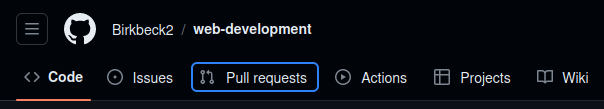

# Accessibility


*Image by <a
href="https://www.freepik.com/free-photo/close-up-blind-man-holding-smartphone_13662487.htm">Freepik</a>*

Earlier this term, Rebekah Cupitt introduced you to

- some research on web accessibility in organizational contexts

- common misconceptions and controversies

- models of disability

- models of accessible design

Building on this understanding, we will now dive into some of the
practical steps you can take to make your web designs and projects more
accessible.

## Circumstances of accessible design

Recall this unified definition of accessibility from your reading (Helen Petrie
et al):

<blockquote class="text-2xl">
“All people, particularly disabled and older people, can use websites in
a range of contexts of use, including mainstream and assistive
technologies; to achieve this, websites need to be designed and developed
to support usability across these contexts.” 
</blockquote>

This definition helps us in several ways to remember a few key circumstances of
accessible design:

<div class="p-12 grid grid-cols-2 gap-16 font-bold text-xl place-items-center
bg-slate-300 text-black">
<div class="text-center">
“all people, particularly disabled and older”
</div>
<div class="text-center">
universal design -> inclusive design
</div>
<div class="text-center">
“contexts of use”
</div>
<div class="text-center">
“Everyone’s a keyboard user when you’re eating a sandwich with your mouse hand” - Adrian Roselli via Ben Myers
</div>
<div class="text-center">
“mainstream and assistive technologies”
</div>
<div class="text-center">
centers the technology as the solvable thing
</div>
</div>

Let us now go through just a few of the most common accessible design patterns,
to get you started.

Just to note, we do not have space to cover everything about web 
accessibility in this segment. If you want a comprehensive introduction
about on the level of this module, see 
[“Learn Accessibility” at web.dev](https://web.dev/learn/accessibility),
which was also a big source of inspiration for the techniques and examples used
here.

## WCAG

The Web Content Accessibility Guidelines provide code-agnostic benchmarks for
the design of presentational and interactive features of web applications.

The current WCAG version is based around four categories:


*Image by <a
href="https://web.dev/learn/accessibility/measure#accessibility_principles">web.dev</a>.
Licensed under [CC BY 4.0](https://creativecommons.org/licenses/by/4.0/)*

## Accessible design so far

You have already learned lots of code patterns that meet WCAG criteria.
Accessible patterns of HTML and CSS have become much more mainstream over the
last 5-10 years. As a result, 
[semantic HTML](./meaning-and-presentation-in-html.md) and responsive CSS are
already accessible if used well.

| Category  | Example |
| --------- | ------- |
| Perceivable | `alt="my cat Bug waiting for lunch"` |
| Perceivable | `@media (max-width: 767px) {flex-direction: column}` |
| Perceivable | `color: white; background-color: darkolivegreen;` |
| Operable | `<title>About - My Website</title>` | 
| Operable | `<nav><ul><li>About</li><li>Contact</li></ul></nav>`  |
| Understandable | `<footer>My Footer</footer>` `<footer>My Footer</footer>` |
| Understandable | `<html lang="en">` |

## Keyboard usability

Many people use a keyboard to navigate through webpages. In some
cases they are looking at the page while navigating, and others
they are listening to it being read aloud.

### Focus

When someone moves through a page using the keyboard, the browser
tracks that movement with “focus”. This happens even with mainstream
browser-keyboard combinations, without the use of a screen reader
like NVDA.

::: tip
To get a feel for focus, press tab several times on website like
[GitHub.com](https://github.com/Birkbeck2/web-development)
:::



By default, links and interactive elements appear in focus, but
most other elements do not. You can use HTML attributes to change
this, as well as their order, but usually you should leave them alone.

More often, you will want or need to style the visual ring that shows
up around a focused element. If you leave it alone, each user’s browser
will use its own setting for the color.

Or you can target it in your CSS with the pseudo-class `:focus`.

<<< @/public/sandbox/css-focus/styles.css#focus{css}

[View in browser](/sandbox/css-focus/index.html){target="_blank"}

### Skip links

On websites with large headers and navbars, keyboard users quickly
grow tired of tabbing many times to reach the main content of the page,
every time the page loads.

The solution is to create an internal link that targets
the main content that becomes visible on focus.

<<< @/public/sandbox/a11y-skip-link/index.html#skip{html}

<<< @/public/sandbox/a11y-skip-link/index.html#main{html}

<<< @/public/sandbox/a11y-skip-link/styles.css#skip{css}

[View in browser](/sandbox/a11y-skip-link/index.html){target="_blank"}

::: info
CSS `position` is used to change up the default CSS box model. By using
`position: absolute` and directional rules like `top` we can place an element
independently of its siblings.
:::

## Color contrast

The colors used on a website can adversely affect you if you have color
blindness or low vision. They can also affect you circumstantially, like if you
are outside on a bright day or reading your phone at night.

Things to note:

- You are more likely to have text background contrast issues with smaller text

- Colors that look quite different to you might have low contrast, because the
  [lightness of two colors might be similar even if the hue is
  different](https://benmyers.dev/blog/fix-low-contrast-text/#get-ratioed).

- Because color is reducible to hex and RGB codes, there is a formula for determining 
  contrast, so checking for contrast issues can sometimes be automated, and there are tools for helping you choose contrasting colors like WebAIM’s [Contrast Checker](https://webaim.org/resources/contrastchecker/) or [app.contrast-finder.org](https://app.contrast-finder.org/?lang=en).

Here is an example of very poor contrast, even with “different” colors:

<<< @/public/sandbox/a11y-color-contrast/styles.css#contrast{css}

[View in browser (if you dare!)](/sandbox/a11y-color-contrast/index.html){target="_blank"}

## Structuring pages with landmarks

Recall we discussed using [landmark
elements](./meaning-and-presentation-in-html.md) to announce the regions
of a page.

<<< @/public/sandbox/html-landmarks/index.html{html}

[View in browser](/sandbox/html-landmarks/index.html){target="_blank"}

::: tip
Try inspecting this page and looking for the accessibility tree in your browser
tools.
:::

Screen reader users depend on these landmarks for a high-level overview of
each webpage they visit. The browser creates a tree from the landmark
elements that you can move through with assistive technology.

<iframe width="560" height="315"
src="https://www.youtube-nocookie.com/embed/FfM3qvEWHjk?si=KXs4MqoOP0HmRIZS"
title="YouTube video player" frameborder="0" allow="accelerometer;
autoplay; clipboard-write; encrypted-media; gyroscope; picture-in-picture;
web-share" allowfullscreen></iframe>

## Augmenting HTML with ARIA

Most of the time, if you use modern HTML and CSS well, your website will be
accessible. However, sometimes HTML needs extra help to create a great user
experience for screen reader users.

ARIA (Accessible Rich Internet Applications) was created to provide this extra
glue for HTML, with the intent of making it more accessible. When ARIA was invented
in 2008, HTML was not very semantic, so a lot of work had to be done--you had to
use a *lot* of ARIA. But now, you only need ARIA in a few cases.

For example, the `section` element needs a name for for screen readers to
know what to do with it. ARIA provides the `aria-label` and
`aria-labeledby` attributes.

<<< @/public/sandbox/a11y-aria-label/index.html#aria{html}

[View in browser](/sandbox/a11y-aria-label/index.html){target="_blank"}

::: tip
Check out the accessibility tree in browser tools to see the labels take
effect.
:::

Still think you need ARIA? Read about its [history and rules of
usage](https://web.dev/learn/accessibility/aria-html).

## Check your understanding

1. Name some HTML and CSS techniques that you already knew how to do
   before today that contribute to accessibility.

2. True or false: The browser “focus” tracks where the mouse pointer is on
   the page.

3. True or false: A skip link is meant to help the user skip the
   navigation bar.

4. What problem might screen reader users have this markup?
   
   ```html
   <body>
     <div>
       <h1>Important subject</h1>
       <p>I have something very important to tell you</p>
     </div>
   </body>
   ```

5. Why is ARIA not needed so often any more?

## References

Contrast-Finder. “Contrast Finder.” Accessed November 14, 2023.
https://app.contrast-finder.org/?lang=en. 

Fisher, Carie, Alexandra White, and Rachel Andrew. “Learn Accessibility.”
web.dev. Accessed November 14, 2023. https://web.dev/learn/accessibility.

Myers, Ben, Brittney Postma, and Alex Patterson. “A11y with Ben Myers.”
CodingCat.dev, September 7, 2022.
https://codingcat.dev/podcast/2-38-a11y-with-ben-myers.

Myers, Ben. “How to Fix Your Low-Contrast Text.” Ben Myers, April 10, 2022.
https://benmyers.dev/blog/fix-low-contrast-text/.

Petrie, Helen, Andreas Savva, and Christopher Power. “Towards a Unified
Definition of Web Accessibility.” In Proceedings of the 12th International
Web for All Conference, 1–13. W4A ’15. New York, NY, USA: Association for
Computing Machinery, 2015. https://doi.org/10.1145/2745555.2746653.

WebAIM. “Contrast Checker,” 2023. https://webaim.org/resources/contrastchecker/.
