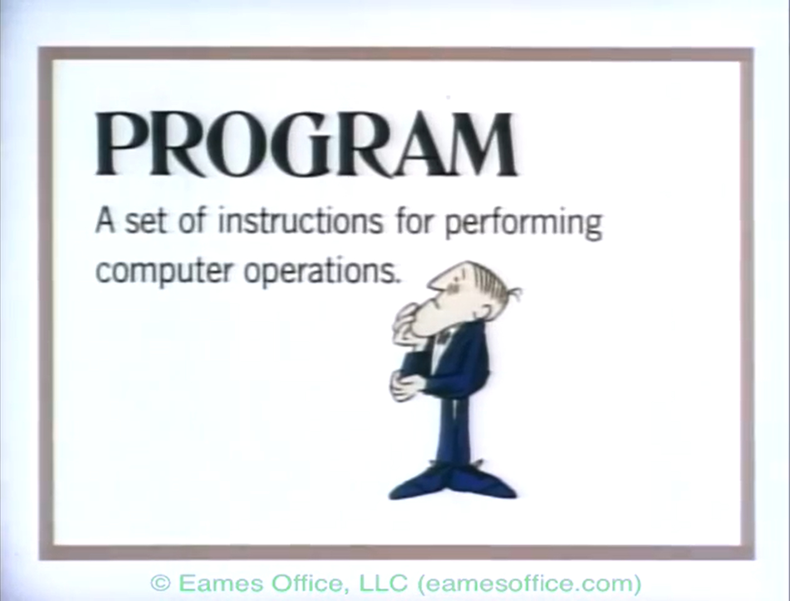

# Setting up conditional statements

## What is programming?

*A Computer Glossary*  
[](https://www.youtube.com/watch?v=eIgX6sPOqCY&t=104s&ab_channel=EamesOffice)
Shown at IBM pavilion at the 1968 World's Fair. An Eames film with animation by Glen Fleck and original score by Elmer Bernstein.  

A program is a set of instructions for performing computer operations.  

MEMORY / ACTION / DECISION / REPETITION - The universal modules of any computer program:  
MEMORY >> Variables  
ACTION >> Functions  
DECISION >> Conditionals  
REPETITION >> Loops  

JavaScript is a programming language that can modify digital objects such as websites and datasets.  

## Conditionals

Conditionals are how a program is able to act in a non-linear way (also called conditional execution).

Conditionals are the DECISION part of programming.

## If

A conditional is a block of code that is executed depending on the true/false value of a statement (if the statement is true, the code is executed, but not if false).

In JavaScript you create a conditional using the keyword `if`. The statement being assessed (the condition) comes after the `if` keyword in brackets `()` and is followed by the code to be executed. If the condition is true and there is more than one line of code to be executed, these are placed in curly brackets `{}`.

Example:

<<< @/public/sandbox/VDWP1_ConditionalsAndFunctions/conditionalsEx1.js{js}

Example:

<<< @/public/sandbox/VDWP1_ConditionalsAndFunctions/conditionalsEx1a.js{js}

## If else

If you want some code to execute if the statement is assessed as false, you can use an `if else` statement.

Example:

<<< @/public/sandbox/VDWP1_ConditionalsAndFunctions/conditionalsEx2.js{js}

Example:

<<< @/public/sandbox/VDWP1_ConditionalsAndFunctions/conditionalsEx2a.js{js}

If there are more than two possible outcomes then a chain of `if else` pairs can be put together.

Example:

<<< @/public/sandbox/VDWP1_ConditionalsAndFunctions/conditionalsEx2b.js{js}

Example:

<<< @/public/sandbox/VDWP1_ConditionalsAndFunctions/conditionalsEx2c.js{js}

## Switch

Instead of doing a long chain of `if` ... `else` statements, you can use `switch` instead.

In a `switch` statement an expression inside `()` is evaluated. After an opening `{` different `case` clauses are listed and tested. When one is found which is correct this leads to execution of the commands that follow it until a `break` occurs or the program ends with a `}`.

Example:

<<< @/public/sandbox/VDWP1_ConditionalsAndFunctions/conditionalsEx3.js#snippet{js}

Example:

<<< @/public/sandbox/VDWP1_ConditionalsAndFunctions/conditionalsEx3a.js{js}

## While

Sometimes you want to repeat an operation many times. You could do this by writing out the same code many times, but that is not very efficient:

Example:

```js
console.log(0);
console.log(2);
console.log(4);
console.log(6);
console.log(8);
console.log(10);
console.log(12);
```

A better way to repeat an operation many times is to code a loop.

Loops are a more efficient way of doing REPETITION in programming.

One type of loop makes something happen whilst a condition is true. This is called a `while` loop.

Example:  

<<< @/public/sandbox/VDWP1_ConditionalsAndFunctions/conditionalsEx4.js{js}

If you forget to increase the variable used in the condition, the loop will never end. This will crash your browser.

Block scope: Variables declared with let inside {} cannot be accessed outside of this block. Variables declared with var inside {} can be accessed outside this block.

## References

[https://eloquentjavascript.net/02_program_structure.html](https://eloquentjavascript.net/02_program_structure.html)  
[https://developer.mozilla.org/en-US/docs/Web/JavaScript/Reference/Statements/switch](https://developer.mozilla.org/en-US/docs/Web/JavaScript/Reference/Statements/switch)  
[https://www.w3schools.com/js/js_scope.asp](https://www.w3schools.com/js/js_scope.asp)  
