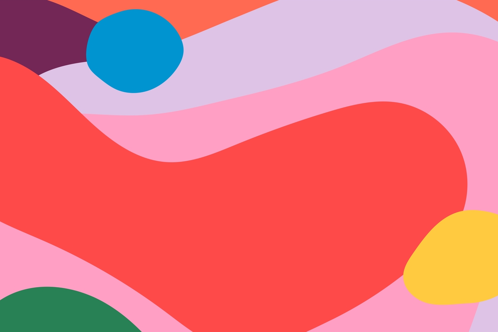

Visual Design and Web Project | Coding Sessions | Helena Wee

[Previous](APIs-and-fetching-data.md) | [All](README.md) | [Next](command-line-tools.md)

## Drawing shapes, text and transformations



## SVG

SVG stands for scalable vector graphics.

It is DOM-based and is a document-markup language that focuses on shapes rather than text. You can embed an SVG document directly in an HTML document or include it with an  tag.

This is an example of SVG embedded within HTML:

```
<p>Normal HTML here.</p>
<svg xmlns="http://www.w3.org/2000/svg">
  <circle r="50" cx="50" cy="50" fill="red"/>
  <rect x="120" y="5" width="90" height="90"
        stroke="blue" fill="none"/>
</svg>
```

The xmlns attribute changes the element and its children to a different XML namespace. `<circle>` and `<rect>` tags don't exist in HTML but are used in SVG to draw shapes at a certain position determined by their x and y attributes.

These are DOM elements like normal HTML elements and can thus be changed using scripts. The following script changes the <circle> element to be coloured cyan instead:

```
let circle = document.querySelector("circle");
circle.setAttribute("fill", "cyan");
```

## Canvas

Canvas graphics are drawn onto the `<canvas>` element, which can be given a width and a height in pixels.

There are two types of drawing: "2d" for two-dimensional graphics and "webgl" for three-dimensional graphics through the OpenGL interface. We will just look at "2d" graphics.

You can create a context object using the getContext method on the `<canvas>` DOM element. This object has methods with which you can draw on the <canvas>.

The coordinate system that canvas uses puts (0, 0) at the top-left corner with the positive y-axis going down from there, and the x-axis going up to the right.

## Canvas rectangles

A shape can be filled (its area is a certain colour) or stroked (a line is drawn on its edge).

Here are a few methods and properties that are available for drawing rectangles:

context.rect(x,y,width,height);
context.fillRect(x,y,width,height);
context.fillStyle=color|gradient|pattern;
context.strokeStyle=color|gradient|pattern;
context.lineWidth=number;

The `fillRect()` and `strokeRect()` methods draw rectangles by taking the first x- and y- coordinates of the rectangle's top-left corner, then the width, and then the height.

The `fillStyle` and `strokeStyle` properties can be set to a colour using CSS notation.

The `lineWidth` property sets the width of strokes with any positive number.

Here we create some rectangular bars to represent yearly US population numbers:

```
let USpopulation = [];
let canvas = document.querySelector("canvas");
let cx = canvas.getContext("2d");

fetch('http://api.worldbank.org/v2/countries/USA/indicators/SP.POP.TOTL?per_page=5000&format=json')
.then(data => {
  return data.json();
})
.then(jsonArr => {
    let myArray = jsonArr[1];
    for(let i=1960; i<2021; i++){
      USpopulation.push(myArray[i-1960]);
    }
    return USpopulation;
})
.then(drawRects => {
    for(let i=1960; i<2021; i++){
      let num = i-1960;
      let height = Math.round((USpopulation[num].value)/1000000);
      cx.fillStyle = "red";
      let x = 620-((num*10)+10);
      let y = (350-height)+10;
      let width = 5;
      cx.fillRect(x, y, width, height);
    }
});
```

## Canvas paths

A path is a sequence of lines.

Here are some methods used for drawing paths:

context.beginPath();
context.moveTo(x,y);
context.lineTo(x,y);

To draw a path you begin it, then you make some method calls describing its shape. Here we draw some paths and style the strokes with an emoji pattern:

```
let cx = document.querySelector("canvas").getContext("2d");
let patternImg = new Image();

getEmojis("https://api.github.com/emojis")
.then(emojiData => {
  patternImg.src=emojiData.smiling_face_with_three_hearts;
  patternImg.onload=function(){
    let pattern = cx.createPattern(patternImg,'repeat');
    cx.strokeStyle = pattern;
    cx.lineWidth = 64;
    cx.beginPath();
    for (let y = 32; y < 545; y += 128) {
      cx.moveTo(0, y);
      cx.lineTo(768, y);
    }
    cx.stroke();
  }
});

async function getEmojis(file) {
  let myObject = await fetch(file);
  let myJSobj = await myObject.json();
  return myJSobj;
}
```

Use the `fill()` method (context.fill();) to fill a path. A path can contain many shapes, each new one starts with a `moveTo()` call. Before a path shape can be filled it needs to be closed. If the path is not already closed a line is added from its end to its start, and the enclosed shape is filled.

## Canvas curves

context.quadraticCurveTo(cpx,cpy,x,y);

The `quadraticCurveTo()` method draws a curve to a given point. The first two parameters define a control point which attracts the line giving it its curve. The line doesn't go through the control point. The last two parameters define the destination or end point.

```
<canvas></canvas>
<script>
  let cx = document.querySelector("canvas").getContext("2d");
  cx.beginPath();
  cx.moveTo(10, 90);
  // control=(60,10) goal=(90,90)
  cx.quadraticCurveTo(60, 10, 90, 90);
  cx.stroke();
</script>
```
      
context.bezierCurveTo(cp1x,cp1y,cp2x,cp2y,x,y);

The `bezierCurveTo()` method draws a similar curve but with two control points and then the destination point.

```
<canvas></canvas>
<script>
  let cx = document.querySelector("canvas").getContext("2d");
  cx.beginPath();
  cx.moveTo(10, 90);
  // control1=(10,10) control2=(90,10) goal=(50,90)
  cx.bezierCurveTo(10, 10, 90, 10, 50, 90);
  cx.stroke();
</script>
```
      
The farther the control points are away from their corresponding ends the more the curve will bulge in that direction.

## Canvas arcs and circles

The `arc()` method draws a line that curves along the edge of a circle. Its parameters are the coordinates of the centre of the arc, a radius, and then a start angle and end angle.

The angles are measured in radians. A full circle (360 degrees) has an angle in radians of 2 * Math.PI (about 6.28). Angles are counted from the point to the right of the circle's centre going clockwise.

To draw a full circle the end angle needs to be 2 * Math.PI more than the start angle:

```
let cx = document.querySelector("canvas").getContext("2d");

fetch('https://earthquake.usgs.gov/earthquakes/feed/v1.0/summary/all_hour.geojson')
.then(geoData => {
  return geoData.json();
})
.then(geoDataObj => {
  let geoArray = geoDataObj.features;
  for (let i = 0; i < geoArray.length; i++){
    let magnitude = geoArray[i].properties.mag * 10;
    console.log(magnitude);
    let x = geoArray[i].geometry.coordinates[0];
    console.log(x);
    let y = geoArray[i].geometry.coordinates[1];
    console.log(y);
    let location = geoArray[i].properties.place;
    cx.translate(180, 90);
    cx.beginPath();
    cx.arc(x, y, magnitude, 0, 2 * Math.PI);
    cx.strokeStyle = "red";
    cx.stroke();
    cx.font = "16px Arial";
    cx.fillStyle = "blue";
    cx.fillText(location, x, y+8);
  }
});
```

## Canvas text

context.fillText(text,x,y,maxWidth);

The `fillText()` method can draw text to the canvas, the first parameter being the string, the next two being the left position of the baseline on which to draw the letters.

context.strokeText(text,x,y,maxWidth);

The `strokeText()` method can be used to draw outlined letters and is used in a similar way.

```
<canvas></canvas>
<script>
  let cx = document.querySelector("canvas").getContext("2d");
  cx.font = "28px Georgia";
  cx.fillStyle = "fuchsia";
  cx.fillText("I can draw text, too!", 10, 50);
</script>
```

The textAlign property changes the horizontal position to "end" or "center".

The textBaseline property sets the vertical position to "top", "middle", or "bottom".

## Canvas images

You can create an  element using code, and load an image file into it. To do this a "load" event handler is used to do the drawing after the image has loaded.

context.drawImage(img,x,y);
context.drawImage(img,x,y,width,height);
context.drawImage(img,sx,sy,swidth,sheight,x,y,width,height);

The `drawImage()` method allows drawing pixel data (including images) onto a canvas. The pixel data could come from an `` element or another canvas.

`drawImage()` draws the image at its original size by default. Two additional arguments can be added to set a new width and height.

You can use `drawImage()` to draw part of an image. This is useful for creating multiple sprites (image elements used in animation) into a single image file. In this case it will have nine parameters. The second to firth arguments are the rectangle in the source image to be copied (x, y, width, height). The sixth to ninth arguments are the rectangle on the canvas where the pixels should be copied to.

Here the `clearRect()` method is used to remove previously drawn pixels. The code loads an image and then sets up an interval (repeated timer) to draw the next frame:

```
let cx = document.querySelector("canvas").getContext("2d");
let img = document.createElement("img");
img.src = "images/flamesprites.png";
let spriteW = 300, spriteH = 300;
img.addEventListener("load", () => {
  let cycle = 0;
  setInterval(() => {
    cx.clearRect(0, 0, spriteW, spriteH);
    cx.drawImage(img,
                // source rectangle
                cycle * spriteW, 0, spriteW, spriteH,
                // destination rectangle
                0, 0, spriteW, spriteH);
    cycle = (cycle + 1) % 6;
  }, 120);
});
```

The cycle variable tracks the position in the animation, and computes the x-coordinate that the sprite for the current pose has in the picture.

## Canvas transformations

context.scale(scalewidth,scaleheight);

The `scale()` method will cause anything drawn after it to be scaled. It has two parameters, one for horizontal scale, and one for vertical scale. Scaling by a negative amount flips the picture around point (0, 0). Scaling affects everything about the image including line width.

context.translate(x,y);

You can adjust the axis around which scaling happens by changing the coordinate system of the canvas. This can be done using the `translate()` method.

context.rotate(angle);

You can also use the `rotate()` method to rotate the coordinate system.

```
let cx = document.querySelector("canvas").getContext("2d");

cx.translate(400, 300);
cx.scale(2, .5);

for(let i = 0; i < 2*Math.PI; i+=Math.PI/6){
  cx.rotate(Math.PI/6);
  cx.fillStyle = "LightPink";
  cx.fill();
  cx.fillRect(0, -15, 200, 30);
}
```

The transformations stack, meaning that each one happens relative to the previous transformations.

To save and clear transformations:
`save()` saves the state of the current context.
`restore()` returns previously saved path state and attributes.
`resetTransform()` fully resets the transformation.

A reference list (incomplete) of canvas methods and properties can be found here: https://www.w3schools.com/tags/ref_canvas.asp.
                             


## References
https://eloquentjavascript.net/17_canvas.html  
https://developer.mozilla.org/en-US/docs/Web/API/Canvas_API  
https://developer.mozilla.org/en-US/docs/Web/API/Canvas_API/Tutorial/Drawing_shapes  
https://www.w3schools.com/tags/ref_canvas.asp  

## Rights
Copyright Birkbeck, University of London

<a rel="license" href="http://creativecommons.org/licenses/by/4.0/"></a><br />This work is licensed under a <a rel="license" href="http://creativecommons.org/licenses/by/4.0/">Creative Commons Attribution 4.0 International License</a>.

