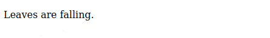

# HTML attributes


_"COLORFUL HOUSE" by Hsuanya Tsai is licensed under [CC BY-NC 2.0](https://creativecommons.org/licenses/by-nc/2.0/?ref=openverse)._

You can see from the way HTML works that text is a primary concern. Most tags come in opening and closing pairs and expect to wrap some span of text.

But really, marking up text is only the most basic functionality of HTML.

What if you want to include images, videos, or audio? What if you want links, buttons, and interactivity?

HTML provides a basis for all these things as well, and the key to unlocking them is HTML *attributes*.

## Variables

To understand attributes, you need to know what variables are in programming.

A *variable* in computer programming is like a label for a container of information. Here’s an example where the information “COLORFUL HOUSE” is being tied to the variable `pictureName`.

```
pictureName="COLORFUL HOUSE"
```

When you write label in your code and tie it to the information, we say you “declare” the variable.

The label is called the variable *name*, and the information is called the variable *value*.

This is often useful because the computer is expecting a specific variable. If you just wrote “COLORFUL HOUSE” in your code, the computer would not know what to do with that information. It only knows what to do with the value when you pass it an expected name.

## How attributes work

In HTML, you can attach variables to each element that you put in your document. These variables give the browser more information about that element. They are called *attributes*.

For example, say you have content in multiple languages in your HTML:

```html
<p>Leaves are falling.</p>
<p>De bladeren vallen.</p>
```

When you read this, you can tell the first one is English and the second one is something else (it's Dutch), but the computer has no idea. When it reads the text out loud or tries to make search results for this page, it won't know what languages is being used so it won't know how to render the content.

With attributes, you can explicitly say what languages are being used. Here's how:

```html
<p lang="en-GB">Leaves are falling.</p>
<p lang="nl">De bladeren vallen.</p>
```

When this information is provided, the computer knows what language is being used, so it can read the text aloud for people using screen readers. It can also populate search engine results properly.

## Visual rendering

How do attributes affect the visual appearance of the webpage?

Usually they don’t, except when used with CSS. The `lang` attribute, for example, does not affect the look of the page at all.



## Syntax

Which pieces of this code are new?

```html
<p lang="nl">De bladeren vallen.</p>
```

We have seen `<` and `>` and `/` before. The new syntax for attributes involves an attribute name inside the opening tag, after the tag name:

```html
lang
```

And an attribute value, wrapped in quotation marks:

```html
"en-GB"
"nl"
```

Connected with an equals sign:

```html
=
```

## Common attributes

### IDs

The `id` attribute uniquely identifies the element.

```html
<p id="p1">Leaves are falling.</p>
<p id="p2">De bladeren vallen.</p>
```

Like with many attributes, there are rules for `id` values:
1. You should always start an `id` value with a letter
2. There should not be any spaces.
3. It is best to use underscores if you want to separate parts.
4. Each `id` value should be unique within the webpage.

```html
<p id="para 2">Leaves are falling.</p>  // [!code error]
<p id="3">Leaves are falling.</p>       // [!code error]
<p id="para_4">Leaves are falling.</p>
<p id="para_4">Leaves are falling.</p>      // [!code error]
```

### Classes

The `class` attribute is used to put elements in categories for use in CSS code.

```html
<p class="body-text">Leaves are falling.</p>
```

You can put the same class on more than one element.

```html
<p class="body-text">Leaves are falling.</p>
<p class="body-text">Leaves are falling.</p>
```

You can put multiple classes on a single element, separated by a space inside the quotation marks.

```html
<p class="body-text first-para">Leaves are falling.</p>
<p class="body-text last-para">Leaves are falling.</p>
```

### Links

Links in HTML are created by anchoring a URL to a bit of text:


This is done with the `a` element (short for “anchor”) and the `href` attribute (short for “hypertext reference”).

```html{3-5}
<p>Leaves are falling.</p>
<p>For more information, see
  <a href="https://en.wikipedia.org/wiki/Leaf">
    “Leaf” on Wikipedia
  </a>.
</p>
```

Notice that you have to put the text you want to be linked after the opening tag `<a>` and before the closing tag `</a>`.

## Check your understanding
1. Would this work?

    ```html
    <p>Les parisiens</p lang:Francais>
    ```

2. What would this look like in the browser? What would happen when you click on it?

    ```html
    <a href="My website">
      https://example.org
    </a>
    ```

3. Are there any errors in this HTML?

    ```html
    <!DOCTYPE html>
    <html lang="en-GB">
      <head>
        <title>Leaves</title>
      </head>
      <body>
        <h1 id="heading">Leaves</h1>
        <p id:"reference" class="body-text has-link">
          Leaves are <a> href="https://example.org" falling<a>.
        </p>
        <p id="heading" class=body-text normal">
          Leaves are falling.
        </p>
      </body>
    </html>
    ```

Try fixing any errors in the examples above.

## References

“lang,” Mozilla Developer Network, last modified September 14, 2022, [https://developer.mozilla.org/en-US/docs/Web/HTML/Global_attributes/lang](https://developer.mozilla.org/en-US/docs/Web/HTML/Global_attributes/lang).

“The p element,” HTML: The Living Standard, Edition for Web Developers, last updated October 14, 2022, [https://html.spec.whatwg.org/dev/grouping-content.html#the-p-element](https://html.spec.whatwg.org/dev/grouping-content.html#the-p-element).

*HTML: The Living Standard: Edition for Web Developers,* last updated September 28, 2022, https://html.spec.whatwg.org/dev/.
