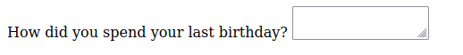

# Forms


_"Enter card details", GOV.UK Design System, licensed under the [Open
Government License
3.0](https://www.nationalarchives.gov.uk/doc/open-government-licence/version/3/)._

So far we have covered how to present information on a webpage.

What if you want to collect information from visitors? This could be text they
type into a field, a selection they make from options you give them, or even
the click of a button.

HTML provides the `form` element for all of these use cases.

## Get and post request methods

To use forms effectively, you need to know about HTTP request methods,
which are ways the client browser categorizes the requests it makes to the
server.

You've already been writing web pages that use one of these methods, the
get method.

The get method is just for getting information from the server, not for
sending information to the server.

Whenever you ask a webpage to load for the first time, the browser sends
a get request.

Another example of a get method: you have a button that filters down
a list of baking recipes by some aspect of the recipe, like whether it has
cinnamon. This doesn't change any data on the server, it just asks the
server to only send back data for cinnamon-related recipes to populate the
HTML in the browser.

You can inspect the method in the network activity pane of the browser.

.

By contrast, the post method sends data to the server, resulting in
a change on the server that persists beyond the response to the client.

For example, if a user signs up for an account, the data is sent via
a post request and the server stores the information for later logins.

If the user buys something, that's another post request, because the
server has to remember what they ordered, when it's supposed to be sent,
and how they are going to pay for it.


## Check your understanding
1. If I like or comment on something  on social media, does that use a get
   or post method?
2. If I look up some information on a
   government website, does that use get or post?

<!--
1. post, probably
2. get
-->

## A birthday form

HTML provides a set of elements and attributes requesting all kinds of
user input.

Here's a simple example:

<<< @/public/sandbox/html-form/index.html#form{html}

[View in browser](/sandbox/html-form/index.html){target="_blank"}

Let's go through each part of this.

## `form`

The `form` element is the container element for all the fields and buttons
in a form.

Use the `method` attribute on the `form` element to say which request
method to use when the form is submitted.

```html
<form method="post"></form>
```

For the birthday form above, we need `post` because we are sending the
user's name and birthday.

The `action` attribute tells the browser what URL to send the data to. It
can be relative or absolute. If you leave it out, the data will be
returned to the same URL as the form page.

```html
<form action="save-birthday-data.html"></form>
```

The example above assumes we have some JavaScript or Python or other code
callable at the relative URL `save-birthday-data.html` that will save the data
in a database on the server. Handling the data in this way is beyond the
scope of this module.

## `label`

Use a `label` element to label each input field.

```html
<label for="first-name">Your name</label>
...
<label for="birthday">Your birthday</label>
```

Bind it to an `input` by using a `for` attribute with a value matching the
`id` of the corresponding `input` element. This helps with accessibility
too.

## `input`

The most common type of field input is called `input`.


```html
<label for="first-name">Your name</label>
<input id="first-name" name="first-name" type="text">
```

Each input needs an `id` to match up with its `label`. It needs a `name`
to serve as the variable name when the field data is sent to the server.

Inputs also need a `type` to set the behavior of the field and activate
automatic field validation.

For general text like a name, use `type="text"`. But for any kind of
information that can be validated like an email or date, use the
appropriate type. This helps with usability because it can helpfully point
out errors in what users type, like an accidental space in an email
address.


```html
<label for="birthday">Your birthday</label>
<input id="birthday" name="birthday" type="date">
```

The birthday field uses `type="date"`. This also takes advantage of the
browser's built-in date-picker widget, which you can override with CSS
styling.

You can also make the input `required` if you wish. This will prevent the
user from submitting the form unless valid data has been provided.

## `textarea`

If you expect users to type a paragraph rather than one line of text, you
can use the `textarea` element. Unlike `input`, it requires a closing tag.

```html
<label for="story">How did you spend your last birthday?</label>
<textarea id="story" name="story"></textarea>
```



## `button`

The `button` element provides a default submit behavior for a parent `form` element.

```html
<button type="submit">Submit</button>
```


You should generally always provide a `type` for the button. In this case
you want `type="submit"`, which tells the browser to send the form to the
action URL when the user clicks this button.

## Check your understanding

1. If I have an input with `id="destination"` and `class="vacation"`, 
   what attributes should the corresponding `label` element have?
2. True or false: it's fine to have an `input` that has no `name` attribute. Why?
3. What's the point of the `type` attribute on `input`?
4. Which form elements are self-closing? 
5. True or false: it's fine to leave the method off the form.
6. True or false: the browser only does something with the action URL
   when the form is submitted.

<!--
1. for="destination"
2. false
3. to set the widget
4. input
5. false, not required but bad practice
6. true
-->

## References

“POST,” Mozilla Developer Network, last updated September 9, 2022,
[https://developer.mozilla.org/en-US/docs/Web/HTTP/Methods/POST](https://developer.mozilla.org/en-US/docs/Web/HTTP/Methods/POST).

“Your first form,” Mozilla Developer Network, last updated October 27,
2022,
[https://developer.mozilla.org/en-US/docs/Learn/Forms/Your_first_form](https://developer.mozilla.org/en-US/docs/Learn/Forms/Your_first_form).

“Forms,” *HTML: The Living Standard: Edition for Web Developers,* last
updated November 24, 2022,
[https://html.spec.whatwg.org/dev/forms.html](https://html.spec.whatwg.org/dev/forms.html).
