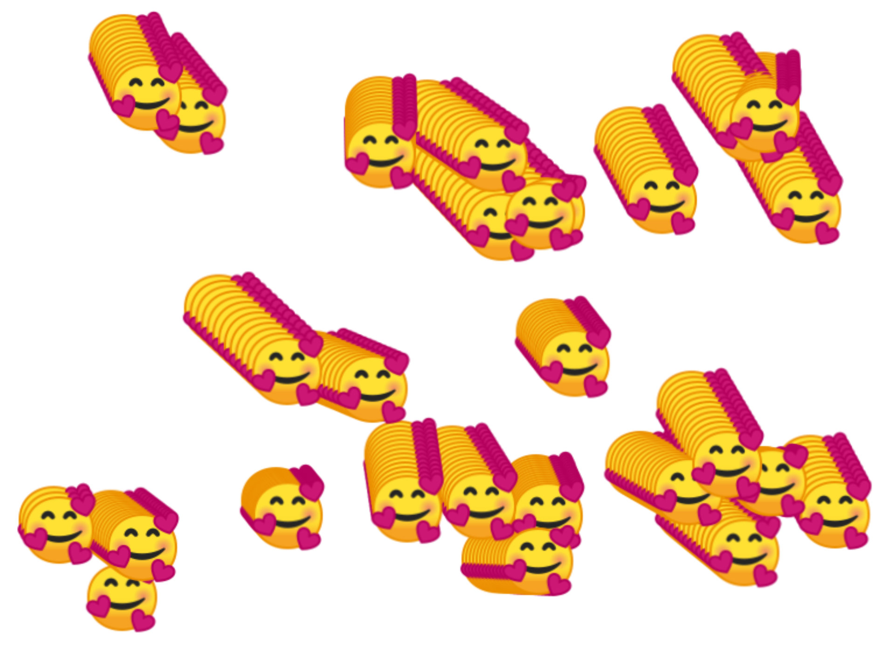

Visual Design and Web Project | Coding Sessions | Helena Wee

[Previous](command-line-tools.md) | [All](README.md)

# JavaScript Animation



## Timing in JavaScript

There are a few functions in JavaScript which deal with timing the calling of functions:

```
// calls function after duration milliseconds from now
setTimeout(function, duration);

// calls function after every duration milliseconds
setInterval(function, duration);

// function clears any timer set by the setTimeout functions
clearTimeout(setTimeout_variable);
```

These can be using in conjunction with CSS styles on document object model elements to create animations.

Here's an example using `setInterval()` :
```
//Position of space station over earth (image moving on top of world map)
let cx = document.querySelector("canvas").getContext("2d");
let worldMap = document.createElement("img");
worldMap.src = "images/worldMap.jpg";
worldMap.style.zIndex = 0;
let iSS = document.createElement("img");
iSS.src = "images/iss.png";
iSS.style.zIndex = 10;


setInterval(function () {
  fetch('http://api.open-notify.org/iss-now.json')
  .then(issData => {
    return issData.json();
  })
  .then(issDataObj => {
    let longitudeX =  issDataObj.iss_position.longitude * 3.5;
    let latitudeY =  -(issDataObj.iss_position.latitude * 4.354);
    //console.log("long = " + longitudeX + " lat = " + latitudeY);
    cx.drawImage(worldMap, 0, 0, 1260, 790);
    cx.translate(924, 494);
    cx.drawImage(iSS, longitudeX - 50, latitudeY - 34, 100, 68);
    cx.resetTransform();
  })
}, 120);
```

Here's an example using `setTimeout()`:

```
//Randomly positioned emojis
let cx = document.querySelector("canvas").getContext("2d");

setTimeout(function() {
  getEmojis("https://api.github.com/emojis")
  .then(emojiData => {
    for(let i=0; i<25; i++){
    let faceImg = new Image();
    faceImg.src = emojiData.smiling_face_with_three_hearts;
    faceImg.onload = function(){
      let locX = Math.round(Math.random() * (736 - 64) + 64);
      let locY = Math.round(Math.random() * (536 - 64) + 64);
      faceImg.style.left = locX;
      faceImg.style.top = locY;
      cx.drawImage(faceImg, locX, locY, 64, 64);
      }
    }
  })
}, 3000);

async function getEmojis(file) {
  let myObject = await fetch(file);
  let myJSobj = await myObject.json();
  return myJSobj;
}
```

Here's another example using `setInterval()` to create trails:

```
//Emoji trails
let cx = document.querySelector("canvas").getContext("2d");
let locs = [];


getEmojis("https://api.github.com/emojis")
.then(emojiData => {
  for(let i=0; i<25; i++){
    let locX = Math.round(Math.random() * (736 - 64) + 64);
    let locY = Math.round(Math.random() * (536 - 64) + 64);
    locs.push([locX, locY]);
  }
  for(let i=0; i<25; i++){
    let newFace = new Emoji(locs[i][0], locs[i][1], emojiData.smiling_face_with_three_hearts);
    newFace.faceImg.onload = function(){
      setInterval(function() {
        newFace.update();
        newFace.display();
        cx.drawImage(newFace.faceImg, newFace.locX, newFace.locY, 64, 64);
      }, 120);
    }

  }
});

async function getEmojis(file) {
  let myObject = await fetch(file);
  let myJSobj = await myObject.json();
  return myJSobj;
}

class Emoji{
  constructor(locX, locY, source){
    this.faceImg = new Image();
    this.faceImg.src = source;
    this.locX = locX;
    this.locY = locY;
    this.stepX = Math.random() * 5;
    this.stepY = Math.random() * 5;
  }
  update(){
    this.locX += this.stepX;
    if(this.locX>736){
      this.locX = 64;
    }
    this.locY += this.stepY;
    if(this.locY>536){
      this.locY = 64;
    }
  }
  display(){
    this.faceImg.style.left = this.locX;
    this.faceImg.style.top = this.locY;
  }
}
```

You can also use `clearInterval()` to clear a timer set with `setInterval()`. To clear an interval, you make a variable equal `setInterval()`, and then use the id returned from this within the clearInterval(intervalId) method:

```
//Button setInterval() and clearInterval() example
<!DOCTYPE html>
<html>
<head>
  <meta charset="UTF-8">
  <meta http-equiv="X-UA-Compatible" content="IE=edge">
  <meta name="viewport" content="width=device-width, initial-scale=1.0">
  <title>Document</title>
  <style>
  #container {
    width: 400px;
    height: 400px;
    position: relative;
    background: yellow;
  }
  #animate {
    width: 50px;
    height: 50px;
    position: absolute;
    background-color: red;
  }
  </style>
</head>
<body>

<p><button onclick="myMove()">Click Me</button></p>

<div id ="container">
  <div id ="animate"></div>
</div>

<script>
function myMove() {
  let id = null;
  const elem = document.getElementById("animate");
  let pos = 0;
  clearInterval(id);
  id = setInterval(frame, 5);
  function frame() {
    if (pos == 350) {
      clearInterval(id);
    } else {
      pos++;
      elem.style.top = pos + "px";
      elem.style.left = pos + "px";
    }
  }
}
</script>

</body>
</html>
```

There is also a `clearTimeout()` method which works in a similar way.

## requestAnimationFrame()

requestAnimationFrame(callback);

The callback is the same as a function or set of instructions to do something.

`requestAnimationFrame()` allows you to execute code on the next available screen repaint, syncing with the user’s browser and hardware to make changes to the screen.

The animation code is called when the user’s computer is ready to make changes to the screen each time, resulting in smoother, more efficient animation.

When `requestAnimationFrame()` is called run in background tabs in the browser these are slowed or paused to further save system resources (no point running an animation that is not seen).

It can be cancelled using `cancelAnimationFrame()`.

```
var adiv = document.getElementById('mydiv')
var leftpos = 0
requestAnimationFrame(function(timestamp){
    leftpos += 5
    adiv.style.left = leftpos + 'px'
})
```

The above code is similar to using `setTimeout()` to run the same code, except instead of after a user defined delay, the code is called on the next available screen repaint, typically 16.7 milliseconds based on typical screen refresh rate of 60fps. The code only runs once.

`requestAnimationFrame()` can be called recursively to construct frame by frame animation, with each frame being called only when the browser is ready for it.

In a re-written version of the first example, the div now moves smoothly across the screen 5 pixels at a time:

```
var adiv = document.getElementById('mydiv');
var leftpos = 0;
function movediv(timestamp){
    leftpos += 50;
    adiv.style.left = leftpos + 'px';
    requestAnimationFrame(movediv); // call requestAnimationFrame again to animate next frame
  }
  requestAnimationFrame(movediv); // call requestAnimationFrame and pass into it animation function
```

Here’s another recursive example that moves a heading:

```
<!DOCTYPE html>
<html>
<head>
    <title>
        Window.requestAnimationFrame() Method
    </title>
</head>

<body>
    <div id="mydiv">
        <h1 style="color:green;">Moving heading</h1>
    </div>

    <script type="text/javascript">

        // Setting the start point for animation
        var start = null;
        var element = document.getElementById('mydiv');

        function startAnim(timestamp) {

            // Timestamp is an integer that represents the number
            // of seconds elapsed since January 1 1970.
            if (!start) start = timestamp;

            // Setting the difference between timestamp
            // and the set start point as our progress
            var progress = timestamp - start;

            // Moving our div element
            element.style.transform =
            'translateX(' + Math.min(progress / 10, 1200) + 'px)';
            window.requestAnimationFrame(startAnim);
        }

        window.requestAnimationFrame(startAnim);
    </script>
</body>

</html>
```

`cancelAnimationFrame()` works in a similar way to `clearTimeout()` and `clearInterval()`. This is through making a variable equal `requestAnimationFrame()`, and then using the id returned from this within the cancelAnimationFrame(requestId) method.

## Other ways to animate in JavaScript

There are many different ways to animate in JavaScript. So far we have seen animation using various timing methods in JavaScript. We can also use a library to do animations on the canvas and elsewhere in the page. Here are some libraries and APIs used in JavaScript animation, but there are also many more:

[p5.js](https://p5js.org/)

Examples of animation in p5.js and Processing: [OpenProcessing](https://openprocessing.org/)

[Web Animations API](https://developer.mozilla.org/en-US/docs/Web/API/Web_Animations_API)

[three.js](https://threejs.org/)


## References
https://www.tutorialspoint.com/javascript/javascript_animation.htm#  
https://www.w3schools.com/jsref/met_win_settimeout.asp  
https://www.w3schools.com/jsref/met_win_cleartimeout.asp  
https://www.w3schools.com/jsref/met_win_setinterval.asp  
https://www.w3schools.com/jsref/met_win_clearinterval.asp  
https://www.w3schools.com/js/js_htmldom_animate.asp  
http://www.javascriptkit.com/javatutors/requestanimationframe.shtml  
https://p5js.org/  
https://openprocessing.org/  
https://developer.mozilla.org/en-US/docs/Web/API/Web_Animations_API  
https://threejs.org/  

## Rights
Copyright Birkbeck, University of London

<a rel="license" href="http://creativecommons.org/licenses/by/4.0/"></a><br />This work is licensed under a <a rel="license" href="http://creativecommons.org/licenses/by/4.0/">Creative Commons Attribution 4.0 International License</a>.

