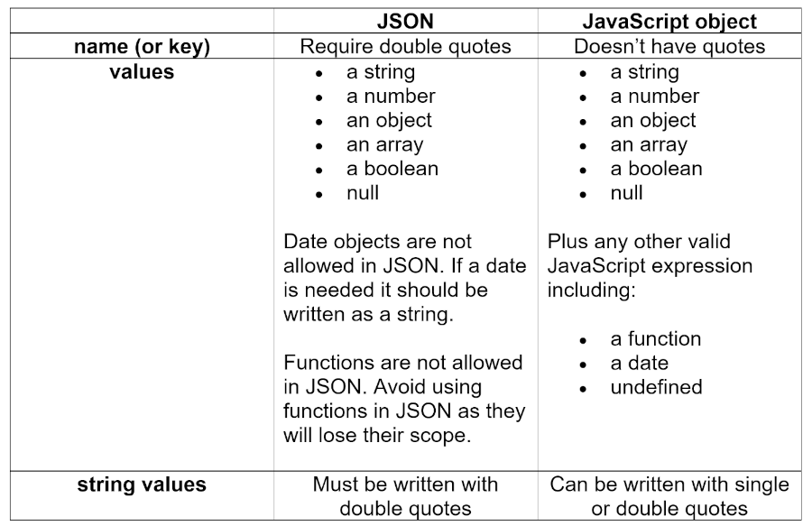

Visual Design and Web Project | Coding Sessions | Helena Wee

[Previous](bugs-and-errors.md) | [All](README.md) | [Next](APIs-and-fetching-data.md)

# Visualising data with Javascript


## JSON data and storage

## History of JSON

JSON or JavaScript Object Notation was introduced in the early 2000s as a way of describing and exchanging text-based data.

JSON was initially developed as a way for JavaScript clients and back-end servers to communicate.

Data is useful in many different ways: to more fully describe what is happening in different systems such as nature, weather, business, communication or politics.

It is native to JavaScript but can also be used with other programming languages. Being human readable, it is easy to use, but also incredibly versatile.

Today JSON is the universal standard of data exchange.

## What is JSON

JSON is a way of serialising objects, arrays, numbers, strings, booleans and null.

It is used to store and transport data. It is self-describing and easy to understand.

When downloading JSON from the internet it normally looks something like this:

```
{"name":"John", "age":30, "car":null}
```

In the example above there are three properties: name, age, and car.

JSON is made up of several name (or key)/value pairs. A name/value pair consists of a name (or key, in double quotes), followed by a colon, followed by a value:

"name":"John"

Each key/value pair is separated by a comma.

JSON strings contain JSON object literals:

```
// JSON string:
'{"name":"John", "age":30, "car":null}'

// JSON object literal:
{"name":"John", "age":30, "car":null}
```

JSON object literals are surrounded by curly braces {}. They contain key/value pairs. Keys and values are separated by a colon. Keys must be strings, and values must be a valid JSON data type:

-	string
-	number
-	object
-	array
-	boolean
-	null

```
// Objects as values in JSON must follow the JSON syntax:
{"employee":{"name":"John", "age":30, "city":"New York"}}

// Values in JSON can be arrays:
{"employees":["John", "Anna", "Peter"]}

//Values in JSON can be true/false:
{"sale":true}

//Values in JSON can be null:
{"middlename":null}
```

JSON makes it possible to store JavaScript objects as text, which is a widely used and thus very accessible and versatile format.

JSON syntax is derived from JavaScript object notation syntax:
-	Data is in name/value pairs
-	Data is separated by commas
-	Curly braces hold objects
-	Square brackets hold arrays

Numbers in JSON must be an integer or a floating point.

## JSON vs JavaScript object



## JSON.parse()

JSON can commonly be used to exchange data to/from a web server. When receiving data from a web server it may come in the form of a JSON string. You can parse the data using `JSON.parse()` to make the data a JavaScript object.

The following text was received from a web server:

```
'{"name":"John", "age":30, "city":"New York"}'
```

Here's how you use the `JSON.parse()` method to convert text into a JavaScript object:

```
const obj = JSON.parse('{"name":"John", "age":30, "city":"New York"}');
```

You need to make sure the text is in JSON format or else you will get a syntax error.

You can then use the JavaScript object in a web page:

```
<p id="demo"></p>
<script>
document.getElementById("demo").innerHTML = obj.name;
</script>
```

Date objects are not allowed in JSON so if you need to include a date, write it as a string (you can convert it to a date object later):

```
const text = '{"name":"John", "birth":"1986-12-14", "city":"New York"}';
const obj = JSON.parse(text);
obj.birth = new Date(obj.birth);

document.getElementById("demo").innerHTML = obj.name + ", " + obj.birth;
```

The reviver parameter of the `JSON.parse()` method is a function that checks each property before returning the value. Here it is used to convert a string into a date:

```
const text = '{"name":"John", "birth":"1986-12-14", "city":"New York"}';
const obj = JSON.parse(text, function (key, value) {
  if (key == "birth") {
    return new Date(value);
  } else {
    return value;
  }
});

document.getElementById("demo").innerHTML = obj.name + ", " + obj.birth;
```

## JSON.stringify()

You can also convert a JavaScript object into a JSON string using `JSON.stringify()`.

When sending data to a web server, data has to be in the form of a string.

To convert a JavaScript object into a string use `JSON.stringify()`.

```
const obj = {name: "John", age: 30, city: "New York"};
const myJSON = JSON.stringify(obj);
```

The result will be a string following the JSON notation. myJSON, will then be ready to be sent to a server.

If date objects or functions are used as values in a JavaScript object, when converting them into a JSON string using `JSON.stringify()` dates will be converted into strings, and any functions will be removed from the object. In the case of functions both key and value will be removed.

## JSON strings for storing JavaScript objects in localStorage

JSON makes it possible to store JavaScript objects as text.

Storing data in local storage:

```
// Storing data:
const myObj = {name: "John", age: 31, city: "New York"};
const myJSON = JSON.stringify(myObj);
localStorage.setItem("testJSON", myJSON);

// Retrieving data:
let text = localStorage.getItem("testJSON");
let obj = JSON.parse(text);
document.getElementById("demo").innerHTML = obj.name;
```

## Acccessing values from JSON using loops or brackets

It is a common mistake to call a JSON object literal "a JSON object".
JSON cannot be an object. JSON is a string format.

To access object values you can use the dot (.) notation:

```
const myJSON = '{"name":"John", "age":30, "car":null}';
const myObj = JSON.parse(myJSON);
x = myObj.name;
```

You can also access object values using bracket ([]) notation:

```
const myJSON = '{"name":"John", "age":30, "car":null}';
const myObj = JSON.parse(myJSON);
x = myObj["name"];
```

You can loop through objects with a for-in loop:

```
const myJSON = '{"name":"John", "age":30, "car":null}';
const myObj = JSON.parse(myJSON);

let text = "";
for (const x in myObj) {
  text += x + ", ";
}
```

You can use the bracket notation to access the property values:

```
const myJSON = '{"name":"John", "age":30, "car":null}';
const myObj = JSON.parse(myJSON);

let text = "";
for (const x in myObj) {
  text += myObj[x] + ", ";
}
```

## JSON Arrays

Arrays in JSON are almost the same as arrays in JavaScript. JSON array values must be of type string, number, object, array, boolean or null.

```
// This is a JSON string:
'["Ford", "BMW", "Fiat"]'

// Inside the JSON string there is a JSON array literal:
["Ford", "BMW", "Fiat"]
```

You can create a JavaScript array using `JSON.parse()`. You can access JSON array values by index, like JavaScript arrays

For more information on JSON arrays goto: https://www.w3schools.com/js/js_json_arrays.asp.

## JSON references and tools

Free to use JSON datasets: https://github.com/jdorfman/awesome-json-datasets.

Use https://jsonbeautify.com/ to look at complicated JSONs and format them so they are understandable.


## References
https://developer.mozilla.org/en-US/docs/Web/JavaScript/Reference/Global_Objects/JSON  
https://developer.mozilla.org/en-US/docs/Web/API/Window/localStorage  
https://www.w3schools.com/js/js_json_parse.asp  
https://www.w3schools.com/js/js_json_stringify.asp  
https://www.w3schools.com/js/js_json_objects.asp  
https://www.w3schools.com/js/js_json_arrays.asp  
https://github.com/jdorfman/awesome-json-datasets  
https://jsonbeautify.com/  

## Rights
Copyright Birkbeck, University of London

<a rel="license" href="http://creativecommons.org/licenses/by/4.0/"></a><br />This work is licensed under a <a rel="license" href="http://creativecommons.org/licenses/by/4.0/">Creative Commons Attribution 4.0 International License</a>.


