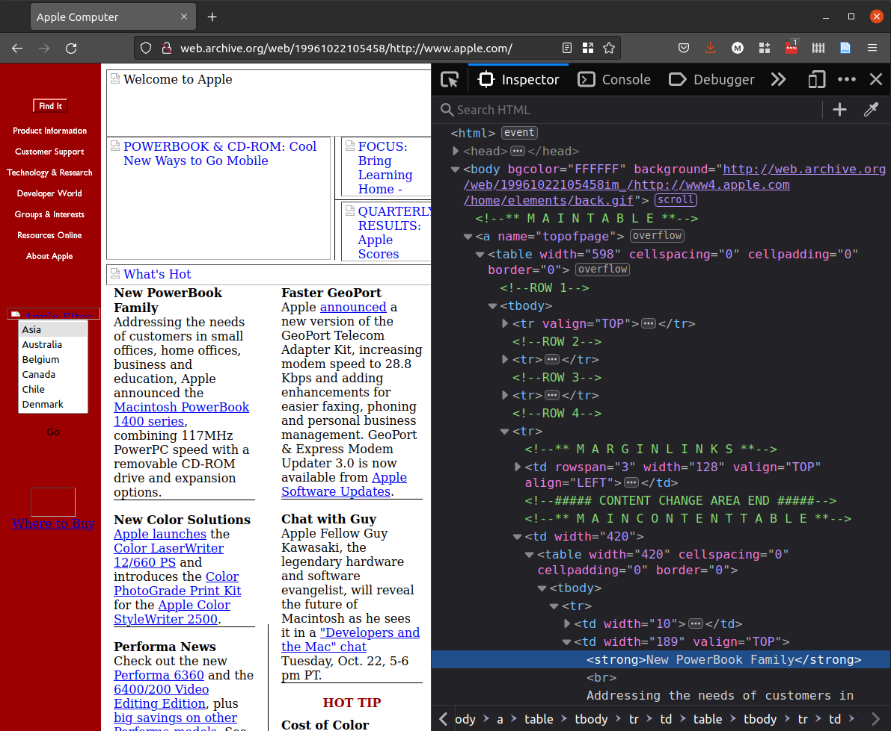
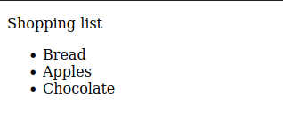
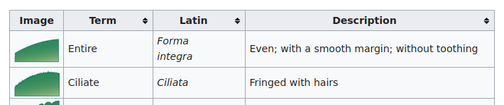

# Meaning and presentation in HTML


_"Optical Illusion" by Jeff Hester is licensed under [CC BY-NC-SA 2.0](https://creativecommons.org/licenses/by-nc-sa/2.0/?ref=openverse)._

People who write HTML have always struggled to find the right place on the spectrum between meaning and presentation.

What is the problem, and how can you solve it?

## Not so long ago in a world without CSS

Before CSS was widely supported by major browsers, early HTML tried to prescribe the look and feel in addition to the structure.

If you went to Apple's website on October 22, 1996, you would have seen this (plus pictures):



_Copyright Internet Archive 1996._

What elements does this page use? Are they semantic or presentational? What attributes does it use?

Most of the elements are used for presentation. They are there to control how the content will be rendered visually on the page.

The headings of the news items don't use `h2` or another heading tag, but `strong`.

The paragraphs are not in `p` tags but separated by `br` (a line break).

The `table` element is not used for data but to create visual columns of unrelated items. Two tables are even nested inside each other, which is not good practice now.

Note also the use of old-style HTML attributes to give display instructions:

```html
<td width="128" valign="TOP" align="LEFT">
```

None of this is now considered good practice.

## Semantic HTML

When CSS grew in popularity, web designers began to
separate content and style more intentionally.

HTML also had room to develop its *semantic* potential.
*Semantic* means “having to do with meaning.” With
the fifth official version of the language, HTML5, a
number of new tags were added that explicitly focused on
meaning, like `nav` and `article`.

Now, after HTML5, in the era of what is called the
[“Living Standard for HTML,”](https://html.spec.whatwg.org/dev/introduction.html#history-2)
there are a range of elements in play, with
varying semantic potential.

Let's go through a few familiar and a few new elements,
discussing how they fit on the appearance-semantics continuum.

## Line break and paragraph

A paragraph is a set of sentences that cohere and relate to each other.

If you are separating paragraphs, use `p` (paragraph), not `br` (break).

```html
<p>Leaves are falling. I can see the sun filtering through them.</p>
<p>Tomorrow something else may happen. It may rain.</p>
```

You should only use use `br` if you have a strictly
presentational reason to break the text onto a new line.

## Importance

For importance, the semantic element is `strong`.

```html
<p>
  <strong>Onions</strong> -
  these keep easily. Cool, dry and airy will do the trick.
</p>
<p>
  <strong>Squash</strong> -
  keep at room temperature with air to breathe...
</p>
```

The only reason to use `b` would be if you want bold text
when it is visually rendered, but you don't mean to
mark the text as more important than its surrounding text.

## Emphasis
For emphasis, the semantic element to use is `em`.

```html
<p>I wonder if people think about the word
  <em>squash</em> when they're eating squash.</p>
```

But if you just want italics to follow a style
convention, use `i`, since it is purely presentational:

```html
<p>Virginia Woolf wrote <i>Mrs Dalloway</i> in 1925.</p>
```

Or use CSS:

```html
<p>Virginia Woolf wrote <span class="book-title">
Mrs Dalloway</span> in 1925.</p>
```

```css
.book-title { font-style: italic; }
```

(We'll get to `span` in a minute.)

## Figures and captions
When you display images, you often want to
provide context for them through a caption.

You could use a `p` for the caption, but then it might be
mistaken for part of the text around it, rather than
referring to the image.

```html
<p>Leaves are falling.</p>

<p>This leaf has 16 points.</p>
<p>Tomorrow it might rain.<p>
```

For this, HTML5 provides `figure`, which is a wrapper
for your `img` element as well as a `figcaption` tag:

```html
<p>Leaves are falling.</p>
<figure>
    
    <figcaption>This leaf has 16 points.</figcaption>
</figure>
<p>Tomorrow it might rain.<p>
```

Using figure to wrap your image with a caption is the best semantic markup.

## Lists

Lists let you structure series of items: this could be
a grocery list, a set of navigation buttons, or a bunch of pictures.

Lists are semantic because they describe the relationships between items.

A list can be either ordered or unordered,
and they use a set of corresponding nested elements.

| Tag (“My name is...”) | Meaning (“I contain...”) |
| --------------------- | ------------------------ |
`ul` | an unordered list
`ol` | an ordered list
`li` | a list item

### Unordered
```html
<p>Shopping list<p>
<ul>
    <li>Bread</li>
    <li>Apples</li>
    <li>Chocolate</li>
</ul>
```

Unordered lists are displayed with bullet points by default:



### Ordered
```html
<p>To get to the shops, you have to<p>
<ol>
    <li>Go down this street until you see the tennis court</li>
    <li>Turn right on William St</li>
    <li>Turn left on Prenshaw Ave</li>
</ol>
```

Ordered lists are automatically numbered by default:


## Tables
In the example of apple.com in 1996, a table was used
so that the promo news items can be displayed in two columns.

But tables should only be used if there is data in
a two-dimensional array, where the vertical and horizontal
alignment conveys meaning.

You can mark up tables of data in HTML with a set of nested elements:

| Tag (“My name is...”) | Meaning (“I contain...”) |
| --------------------- | ------------------------ |
`table` | a table
`tr` | a table row
`th` | a table header (a top-row cell)
`td` | a table datum (a cell)
`thead` | the table header
`tbody` | the table body
`tfoot` | the table footer

Here is an example of some botanical data on Wikipedia.
```html
<table class="wikitable sortable centre jquery-tablesorter">
  <thead>
    <tr>
      <th>Image</th>
      <th>Term</th>
      <th>Latin</th>
      <th>Description</th>
    </tr>
  </thead>
  <tbody>
    <tr>
      <td>
        
      </td>
      <td><span class="anchor" id="Entire"></span>Entire</td>
      <td><i>Forma</i><br><i>integra</i></td>
      <td>Even; with a smooth margin; without toothing</td>
    </tr>
    <tr>
      <td>
        
      </td>
      <td><span class="anchor" id="Ciliate"></span>Ciliate</td>
      <td><i>Ciliata</i></td>
      <td>Fringed with hairs</td>
    </tr>
  </tbody>
  <tfoot>
  </tfoot>
</table>
```

This renders visually:



*This table is from [“Leaf”](https://en.wikipedia.org/wiki/Leaf) on Wikipedia, which is licensed under [CC BY-SA 3.0](https://creativecommons.org/licenses/by-sa/2.0/?ref=openverse)*

Things to notice about tables:

1. The `thead`, `tbody`, and `tfoot` elements are optional.
2. It is time-consuming to manually code tables in HTML!
3. Tables can be difficult to create for mobile screens,
   because horizontal scrolling is discouraged, yet many
   tables have medium or long rows.
4. You can put all kinds of things in tables, though
   whether you should is always debatable.

## Div and span

The two most common purely presentational elements are `div` (division) and `span`.

Designers use these elements primarily to hold `class` attributes for use in their CSS code. Divs can be nested inside other divs.

```html
<div class="collection">
  <div class="card">
    The map had many <span class="spooky">spooky symbols</span>.
  </div>
</div>
```

These can serve a purpose, when you want to do something
presentational that cannot be represented semantically.

What's the difference between `div` and `span`?

### An aside on blocks and lines

The `div` element is a *block* element while `span` is an *in-line* element.

Block elements establish themselves on their own line and take up the entire width of their parent element, while in-line elements only take up their own width, allowing other in-line elements to sit next to them.

Inline elements cannot contain block elements. This is not right:

```html
<span><h1>Leaves</h1></span>
```

## Check your understanding

How would you rank the following elements, from presentational to semantic, on a scale of 1 to 10?

- `span`
- `h4`
- `section`
- `figure`
- `i`
- `tr`

## Landmark elements

There was a time when designers overused `div` elements, even
to separate different regions of the page.

But since HTML5, you have a set of semantic elements
that can be used to signify “landmarks” -- major components
of the page that screen readers and search engines recognise.

The following quoted definitions come from
[WHATWG](https://html.spec.whatwg.org/dev/).

| Tag (“My name is...”) | Meaning (“I contain...”) |
| --------------------- | ------------------------ |
`header` | “a group of introductory of navigational aids”
`nav` | “a section of the page that links to other pages or to parts within the page”
`main` | “the dominant contents of the document”
`article` | “a complete or self-contained composition [that is] independently distributable”
`section` | “a generic section of a document or application” for use where `article` would not work
`aside` | “content that is tangentially related to the content around it”
`footer` | a footer for its parent element or the `body` in general

Together, the use of these semantic elements provides
screen readers and search engines a way to understand the form of the page.

## Page regions

By using landmark elements you can effectively structure the 
regions of any given page. 

Here is one very common combination of page regions:

<div class="text-black text-3xl">
  <div class="p-8 bg-[#F2E8B6] w-full flex justify-center items-center gap-16">
    <div>header</div>
    <div class="bg-[#1C7648] w-2/3 flex justify-center items-center">
      <div class="p-4 text-white">nav</div>
    </div>
  </div>
  <div class="p-8 bg-[#F2A74B] w-full flex justify-center items-center gap-16">
    <div>main</div>
    <div class="w-2/3 flex flex-col gap-8">
      <div class="bg-[#613756] flex justify-center items-center">
        <span class="text-white p-4">article</span>
      </div>
      <div class="bg-[#400101] flex justify-center items-center">
        <span class="text-white p-4">section</span>
      </div>
    </div>
  </div>
  <div class="p-8 bg-[#F2766B] w-full flex justify-center items-center">
    <div>aside</div>
  </div>
  <div class="p-8 bg-[#BDCED0] w-full flex justify-center items-center">
    <div>footer</div>
  </div>
</div>

## Common page structures

With semantic elements, you have the building blocks to formally
represent the relationships on a page.

What are some typical ways of doing so? Here are four of the most common ones.

Want examples as you go through the types? As of this writing in 2022, the
[Great British Bake Off](https://thegreatbritishbakeoff.co.uk/) had versions
of each of these pages, though not all marked up exactly like this.

### Item page

For a page about one thing, like one creative work, one product,
or one person, you can use a very simple structure.

```
                       img src="logo.png"
                      /
            header -- -- nav -- ul -- li x 3
           /
          /
         /                         h1
        /                         /
body -- ------ main -- article -- -- img
        \                         \
         \                         p
          \
           \
            footer --  -- ul class="links" -- li x 2
                       \
                        ul class="social" -- li x 2
```

This structure has just one main `article` element. Depending on
the attributes of the work, product, or personal profile, you
can adjust the elements used inside the `article` element as needed.

### List, gallery, or collection page

Often you will need a page that arrays many, similarly structured
things, such as product search results, an activity feed, or an
image gallery.

For these, you can use `article` if each thing in the collection
is independent of its surroundings, and would have the same meaning
if presented on another page.

```
                       img src="logo.png"
                      /
            header -- -- nav -- ul -- li x 3
           /
          /
         /
        /
body -- ------ main -- -- h1
       |               \                      h2
       |                \                    /
       |                 |-- article -- a -- -- img
       |                 |                   \
       |                 |                    p
       |                 |
       |                 |                    h2
       |                 |                   /
       |                 |-- article -- a -- -- img
       |                 |                   \
       |                 |                    p
       |                 |
       |                 |                    h2
       |                 |                   /
       |                 |-- article -- a -- -- img
       |                 |                   \
       |                 |                    p
       |                 |
       |                 |                    h2
       |                 |                   /
       |                 |-- article -- a -- -- img
       |                 |                   \
       |                 |                    p
       |                  \
       |                   \                  h2
       |                    \                /
       |                      article -- a -- -- img
       |                                     \
        \                                     p
         \
          footer -- -- ul class="links" -- li x 2
                    \
                     ul class="social" -- li x 2
```

As with the item page, the exact structure
of each item will depend on its properties.

Finally, if you want the user to be able to
click on an item to go to its item page,
you can wrap the whole thing in an anchor tag.

### Form page

If you want to prompt user input, such as on a contact page
where you ask for an email address and message, you can just
place the form in the `main` element. Don't forget to add an h1.

```
                       img src="logo.png"
                      /
            header -- -- nav -- ul -- li x 3
           /
          /
         /                            -- -- -- label
        /                           /       \
       |                h1         /         input
       |               /          /
body -- ------ main -- -- form -- -- -- -- -- label
       |                          \         \
       |                           \         input
        \                            button
         \
          \
           footer --  -- ul class="links" -- li x 2
                      \
                       ul class="social" -- li x 2
```

### Landing page

Landing pages are often the first thing visitors see,
yet they are often more complex than other pages.

Web designers want to make a good first impression and
highlight important information from the outset, so they often
try to include multiple, different elements on the home page.

This means you might have to come up with a
custom structure for your home page.

The following home page is designed to have an
advertisement or info banner in the first `section`, followed
by a three-item spread showcasing highlights from a collection.

```
                     img src="logo.png"
                    /
          header -- -- nav -- ul -- li x 3
         /
        /
       |                  h1
       |                 /
       |                /
       |               |            img
       |               |           /
body -- ------ main --- -- section -- p x 2
       |               |
       |                \
       |                 section -- -- h2
       |                           |                    h3
       |                           |                   /
       |                           |-- article -- a -- -- img
       |                           |                   \
       |                           |                    p
       |                           |
       |                           |                    h3
       |                           |                   /
       |                           |-- article -- a -- -- img
       |                           |                   \
       |                           |                    p
       |                            \
       |                             \                  h3
       |                              \                /
       |                                article -- a -- -- img
        \                                              \
         \                                              p
          footer --  -- ul class="links" -- li x 2
                     \
                      ul class="social" -- li x 2
```

### Where are all the divs?

These examples are miraculously, almost unbelievably
free of divs, in order to show just the semantic structure of the page.

In reality, you will likely need at least a few divs
as wrappers for your semantic elements, for styling purposes.

But don't forget to keep things meaningful, even when you get
div-happy! Having a clear understanding of page types as you lay
out your website will help you maintain a clear structure using semantic elements.

## Check your understanding
1. You're making a website for a podcast. What page type do you use for each episode?
2. You're making a website for a restaurant. What page type do you use for a dinner menu?
3. What can you put in an `a` tag? Is there anything you can't put in it?
4. Can you have a page with an `h2` but no `h1`? How about a page with an `h1` and some `h4` elements, but no `h2` or `h3` elements?
5. Should your header and footer always be the same across different pages?

<!--
1. item
2. list / gallery / collection
3. almost anything short of body, except interactive elements
4. not good practice, as heading levels should not have gaps
5. generally speaking, yes
-->

## References
Shaye Howe, “Getting to Know HTML,” *Learn to Code HTML and CSS*, https://learn.shayhowe.com/html-css/getting-to-know-html/.

“Semantic HTML,” LearnHTML!, [https://web.dev/learn/html/semantic-html/](https://web.dev/learn/html/semantic-html/).

*HTML: The Living Standard: Edition for Web Developers,* last updated September 28, 2022, https://html.spec.whatwg.org/dev/.
