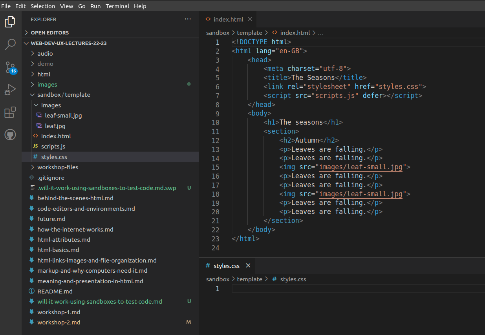
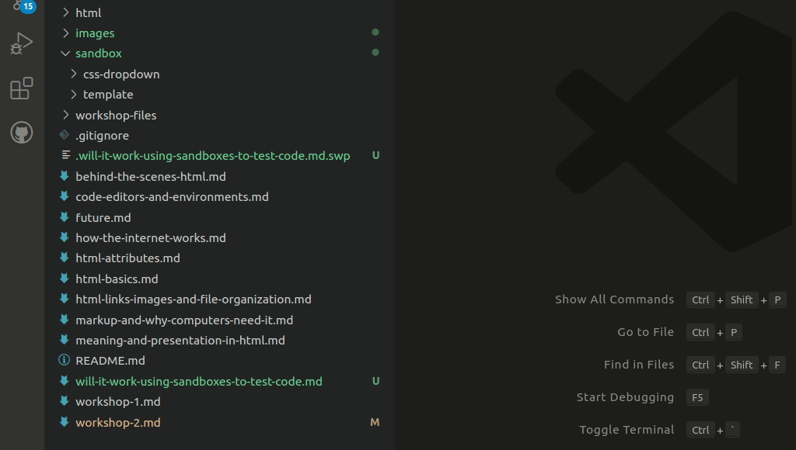

# Will it work? Using sandboxes to run code experiments

When you get stuck, there are many ways to get unstuck. You can search online,
review readings and lecture notes, ask a colleague, or sleep on it to see if
fresh eyes will help you see things differently.

If the problem is whether something will work, you have one more tool. You can
test it, like a scientist, in a controlled environment.

In web development, such environments are often called "sandboxes" because they
are meant to be safe places to play around in. By isolating one bit of code in
a sandbox, you don't have to worry about a mistake in the sandbox affecting
your other code, and you can also minimize the interference from other parts of
your code on what you test.

## Setting up a sandbox template

Sandboxes need to be easy to create, because you don't want to lose time
switching from the main project. If it's too difficult, you won't do it.

To make it easy for yourself, create a folder called `sandbox` inside or near
your project folder, so that it is always ready to hand.

Inside the sandbox folder, create a folder named `template`.

Finally, inside the template folder, create the basic files that will give you
most of what you need to test things.

For example, if you are testing CSS or JavaScript, make an empty `styles.css`,
an empty `scripts.js`, an `images` folder with one or two small images, and an
`index.html` file with some boilerplate text and anchor tags importing the
images.

You can make your own, or you can use
[my sandbox on GitHub](https://github.com/Birkbeck2/web-development/tree/main/public/sandbox/template)
and modify it to suit your needs.

## Running experiments

Once you have the template set up, it is trivial to create a new sandbox
dedicated to your burning "Will it work?" question.

1. Formulate a hypothesis. What do you want to test? Narrow it down to just one
   thing per sandbox, so that you don't have interference between pieces of
   code.

2. Copy and paste the template folder and rename it with a keyword of the thing you want to test.

   

   Note: to turn off GIF autoplay on GitHub, adjust your Motion preference in the [Accessibility settings](https://github.com/settings/accessibility).

3. Open up the relevant files in the new sandbox and conduct your experiment.

4. Observe the results. Was your hypothesis correct? If not, start again with
   step 1.
