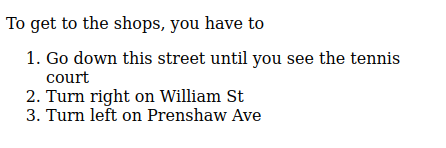

Web Development and User Experience | Coding Session 2 | Joseph Muller

[Previous](behind-the-scenes-html.md) | [All](README.md) | [Next](workshop-2.md)

# Meaning and presentation in HTML


_"Optical Illusion" by Jeff Hester is licensed under [CC BY-NC-SA 2.0](https://creativecommons.org/licenses/by-nc-sa/2.0/?ref=openverse)._

People who write HTML have always struggled to find the right place on spectrum between meaning and presentation.

What is the problem, and how can you solve it?

## Not so long ago in a world without CSS

Before CSS was widely supported by major browsers, early HTML tried to prescribe the look and feel in addition to the structure.

If you went to Apple's website on October 22, 1996, you would have seen this (plus pictures):


_Copyright Internet Archive 1996._

What elements does this page use? Are they semantic or presentational? What attributes does it use?

Most of the elements are use for presentation. They are there to control how the content will be rendered visually on the page.

The headings of the news items don't use `h2` or another heading tag, but `strong`.

The paragraphs are not in `p` tags but separated by `br` (a line break).

The `table` element is not used for data but to create columns. Two tables are even nested inside each other, which is not good practice now.

Note also the use of old-style HTML attributes to give display instructions:

```html
<td rowspan="3" width="128" valign="TOP" align="LEFT">
```

None of this is now considered good practice.

## Semantic HTML

When CSS grew in popularity, web designers began to separate content and style more intentionally.

HTML also had room to develop its *semantic* potential. *Semantic* means “having to do with meaning.” With the fifth official version of the language, HTML5, a number of new tags were added that explicitly focused on meaning, like `nav` and `article`.

Now, after HTML5, in the era of what is called the [“Living Standard for HTML,”](https://html.spec.whatwg.org/dev/introduction.html#history-2), there are a range of elements in play, with varying semantic potential.

Let's go through a few familiar and a few new elements, discussing how they fit on the appearance-semantics continuum.

## Line break and paragraph

A paragraph is a set of sentences that cohere and relate to each other.

If you are separating paragraphs, use `p` (paragraph), not `br` (break).

```html
<p>Leaves are falling. I can see the sun filtering through them.</p>
<p>Tomorrow something else may happen. It may rain.</p>
```

You should only use use `br` if you have a strictly presentational reason to break the text onto a new line.

## Importance

For importance, the semantic element is `strong`.

```html
<p><strong>Onions</strong> - these keep easily. Cool, dry and airy will do the trick.</p>
<p><strong>Squash</strong> - keep at room temperature with air to breathe...</p>
```

The only reason to use `b` would be if you want bold text when it is visually rendered.

## Emphasis
For emphasis, the semantic element to use is `em`.

```html
I wonder if people think about the word <em>squash</em> when they're eating squash.
```

But if you just want italics to follow a style convention, use `i`, since it is purely presentational:

```html
<p>Virginia Woolf wrote <i>Mrs Dalloway</i> in 1925.</p>
```

Or use CSS:

```html
<p>Virginia Woolf wrote <span class="book-title">Mrs Dalloway</span> in 1925.</p>
```

```css
   .book-title { font-style: italic; }
```

## Figures and captions
When you display images, you often want to provide context for them through a caption.

You could use a `p` for the caption, but then it might be mistaken for part of the text around it, rather than referring to the image.

```html
<p>Leaves are falling.</p>

<p>This leaf has 16 points.</p>
<p>Tomorrow it might rain.<p>
```

For this, HTML5 provides `figure`, which is a wrapper for your `img` element as well as a `figcaption` tag:

```html
<p>Leaves are falling.</p>
<figure>
    
    <figcaption>This leaf has 16 points.</figcaption>
</figure>
<p>Tomorrow it might rain.<p>
```

Using figure to wrap your image with a caption is the best semantic markup.

## Lists

Lists let you structure series of items: this could be a grocery list, a set of navigation buttons, or a bunch of pictures.

Lists are semantic because they describe the relationships between items.

A list can be either ordered or unordered, and they use a set of corresponding nested elements.

| Tag (“My name is...”) | Meaning (“I contain...”) |
| --------------------- | ------------------------ |
`ul` | an unordered list
`ol` | an ordered list
`li` | a list item

### Unordered
```html
<p>Shopping list<p>
<ul>
    <li>Bread</li>
    <li>Apples</li>
    <li>Chocolate</li>
</ul>
```

Unordered lists are displayed with bullet points by default:


### Ordered
```html
<p>To get to the shops, you have to<p>
<ol>
    <li>Go down this street until you see the tennis court</li>
    <li>Turn right on William St</li>
    <li>Turn left on Prenshaw Ave</li>
</ol>
```

Ordered lists are automatically numbered by default:



## Tables
In the example of apple.com in 1996, a table was used so that the promo news items can be displayed in two columns. 

Tables should only be used if there is data in a two-dimensional array, where the vertical and horizontal alignment conveys meaning.

You can mark up tables of data in HTML with a set of nested elements:

| Tag (“My name is...”) | Meaning (“I contain...”) |
| --------------------- | ------------------------ |
`table` | a table
`tr` | a table row
`th` | a table header (a top-row cell)
`td` | a table datum (a cell)
`thead` | a table datum (a cell)
`tbody` | a table datum (a cell)
`tfoot` | a table datum (a cell)

Here is an example of some botanical data on Wikipedia.
```html
<table class="wikitable sortable centre jquery-tablesorter">
    <thead>
        <tr>
            <th>Image</th>
            <th>Term</th>
            <th>Latin</th>
            <th>Description</th>
        </tr>
    </thead>
    <tbody>
        <tr>
            <td>
                
            </td>
            <td><span class="anchor" id="Entire"></span>Entire</td>
            <td><i>Forma</i><br><i>integra</i></td>
            <td>Even; with a smooth margin; without toothing</td>
        </tr>
        <tr>
            <td>
                
            </td>
            <td><span class="anchor" id="Ciliate"></span>Ciliate</td>
            <td><i>Ciliata</i></td>
            <td>Fringed with hairs</td>
        </tr>
    </tbody>
    <tfoot>
    </tfoot>
</table>
```

This renders visually:


*This table is from [“Leaf”](https://en.wikipedia.org/wiki/Leaf) on Wikipedia, which is licensed under [CC BY-SA 3.0](https://creativecommons.org/licenses/by-sa/2.0/?ref=openverse)*

Things to notice about tables:

1. The `thead`, `tbody`, and `tfoot` elements are optional.
2. It is time-consuming to manually code tables in HTML!
3. Tables can be difficult to create for mobile screens, because horizontal scrolling is discouraged.

## Div and span

The two most common purely presentational elements are `div` (division) and `span`.

Designers use these elements primarily to hold `class` attributes for use in their CSS code. Divs can be nested inside other divs.

```html
<div class="gryffindor">
    <div class="magical">
        The map had many <span class="spooky">spooky symbols</span>.
    </div>
</div>
```

These can serve a purpose, when you want to do something presentational that cannot be represented semantically.

What's the difference between `div` and `span`?

### An aside on blocks and lines

The `div` element is a *block* element while `span` is an *in-line* element.

Block elements establish themselves on their own line and take up the entire width of their parent element, while in-line elements only take up their own width, allowing other in-line elements to sit next to them.

Inline elements cannot contain block elements. This is not right:

```html
<span><h1>Leaves</h1></span>
```

## Beyond the div

There was a time when designers overused `div` elements, to the exclusion of everything else.

But since HTML5, there are often better alternatives. The following quoted definitions come from [WHATWG](https://html.spec.whatwg.org/dev/).

| Tag (“My name is...”) | Meaning (“I contain...”) |
| --------------------- | ------------------------ |
`header` | “a group of introductory of navigational aids” --WHATWG
`nav` | “a section of the page that links to other pages or to parts within the page” --WHATWG
`main` | “the dominant contents of the document” --WHATWG
`aside` | “content that is tangentially related to the content around it” --WHATWG
`article` | “a complete or self-contained composition [that is] independently distributable”
`section` | “a generic section of a document or application” for use where `article` would not work
`footer` | a footer for its parent element or the `body` in general

Together, the use of these semantic elements provide screen readers and search engines a way to understand the form of the page.


## Check your understanding

How would you rank the following elements, from presentational to semantic, on a scale of 1 to 10?

- `span`
- `h4`
- `section`
- `nav`
- `figure`
- `i`
- `tr`

## References
Shaye Howe, “Getting to Know HTML,” *Learn to Code HTML and CSS*, https://learn.shayhowe.com/html-css/getting-to-know-html/.

“Semantic HTML,” LearnHTML!, [https://web.dev/learn/html/semantic-html/](https://web.dev/learn/html/semantic-html/).

*HTML: The Living Standard: Edition for Web Developers,* last updated September 28, 2022, https://html.spec.whatwg.org/dev/.

## Rights
Copyright Birkbeck, University of London

<a rel="license" href="http://creativecommons.org/licenses/by/4.0/"></a><br />This work is licensed under a <a rel="license" href="http://creativecommons.org/licenses/by/4.0/">Creative Commons Attribution 4.0 International License</a>.
