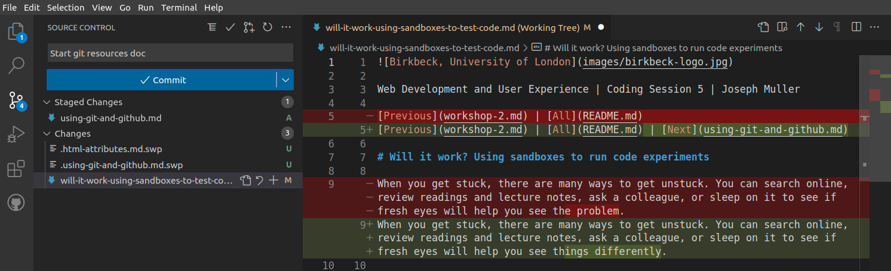

Web Development and User Experience | Coding Session 6 | Joseph Muller

[Previous](html-page-structures.md) | [All](README.md)

# Using Git and GitHub with VS Code

Developers use Git to keep track of versions of a project, sync changes between different members of the team, and look through the history of the project to fix bugs.

Git was originally designed to be used at the command line, with commands like this:

```bash
git diff
```

That command means "What's the difference between the files now and the last time they were added to the version history?"

The console responds with information like this, showing what lines were changed:

```diff
-[Previous](workshop-2.md) | [All](README.md)
+[Previous](workshop-2.md) | [All](README.md) | [Next](using-git-and-github.md)
```

While many developers continue to use Git at the command line, you also have the option of using your code editor (e.g. VS Code) or repository provider (e.g. GitHub) to make Git commands more visual.



## Git concepts
Before you get started, you need to understand the basic Git concepts, which are closely tied to Git commands. This short LinkedIn learning course (19 minutes) walks through each common Git command using legos as a visualization.

> Morten Rand-Hendriksen, "Git from Scratch," LinkedIn Learning, June 30, 2022, [https://www.linkedin.com/learning/git-from-scratch](https://www.linkedin.com/learning/git-from-scratch).

## Git with VS Code
Once you understand the concepts, it's time to integrate Git into your workflow. If you are using VS Code, start with the video at the top of this page (6 minutes) about source control in VS Code.

> "Using Git source control in VS Code," Visual Studio Code, May 27, 2022, [https://code.visualstudio.com/docs/sourcecontrol/overview](https://code.visualstudio.com/docs/sourcecontrol/overview).

## References
Morten Rand-Hendriksen, "Git from Scratch," LinkedIn Learning, June 30, 2022, [https://www.linkedin.com/learning/git-from-scratch](https://www.linkedin.com/learning/git-from-scratch).

"Using Git source control in VS Code," Visual Studio Code, May 27, 2022, [https://code.visualstudio.com/docs/sourcecontrol/overview](https://code.visualstudio.com/docs/sourcecontrol/overview).

## Rights
Copyright Birkbeck, University of London

<a rel="license" href="http://creativecommons.org/licenses/by/4.0/"></a><br />This work is licensed under a <a rel="license" href="http://creativecommons.org/licenses/by/4.0/">Creative Commons Attribution 4.0 International License</a>.
