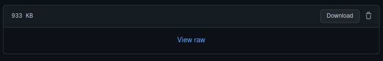

Web Development and User Experience | Coding Session 2 | Joseph Muller

[Previous](meaning-and-presentation-in-html.md) | [All](README.md) | [Next](will-it-work-using-sandboxes-to-test-code.md)

# Coding workshop 2

In this workshop you have a chance to practice marking up a full web page with metadata, pictures, and external links.

You'll also have the unique pleasure of debugging an HTML document using a helpful online tool.

If there's time, you'll be asked to cure a case of divitis.

## Mark up an article with images and links

1. We have provided the text and images for an article about sea serpents in the 16th century. Download it by visiting the [olaus-magnus.zip on GitHub](workshop-files/workshop-2/olaus-magnus.zip). The download button is hard to spot - it's on the far right:

    

2. Unzip or extract the files in your preferred coding folder. Using your knowledge of website file organization, get the files organized in the appropriate folders.

3. Get ready to work on text document in your code editor, which you should make into an HTML document by renaming it.

4. Work through the document to mark up each part as appropriate, using what you've learned about the following:

    - What metadata should be declared, and how
    - How to include images (the image file names appear where the images should go)
    - What to do about captions
    - How to include external hyperlinks (links appear right after the paragraph they belong to and should usually be attached to the word “Source”)
    - Which semantic elements to use for a given purpose

    Note: Don't worry about the look and feel of your web page, since we don't have any CSS yet. Just focus on making it a well-structured HTML document.

### Checklist
- How did you handle the block quotes beginning “They who in Works of Navigation...” and “. . . the wondrous tales told by Pontoppidan”?
- What did you do about alt text?
- What will your webpage look like in a search result? When shared on social media?
- How did you use semantic HTML?

## Debug a buggy document with an HTML validator (if time)
5. We have provided another set of files for an image gallery. You can download them from [design-typography.zip on GitHub](workshop-files/workshop-2/design-typography.zip).

6. This time, you have the text marked up in HTML, but it's got lots and lots of bugs :bug::bug::bug::bug::bug:. Your task is to debug the file. There are a few ways to do this - give each one a try:

    - :book: Reading it really carefully (this is really hard for humans to do, but give it a try--you'll probably spot some things)
    - :eyes: Opening it in your web browser to look at how it renders and try to make educated guesses about what problems could cause what you're seeing
    - :bulb: Using the [Nu HTML Checker](https://validator.w3.org/nu/) from the World Wide Web Consortium - this is really helpful and a good habit to get into before you send off any HTML file
    - :wrench: Use whatever debugging tools your code editor or web browser provide

## Help, doctor! I've got the divs (if time)
7. If you have time, here's one more challenge. The gallery page you just debugged is a suffering from a mild case of divitis (the overuse of `div` elements). How could you make it more semantic? Try modifying it to use HTML elements that convey the meaning of the content, where appropriate.

<!--
Hints:
- Use a main element to differentiate the main gallery from the header
- Use a ul instead of a set of divs for the images
- Use a figure and figcaption for each image and caption
-->

## References
Nu HTML Checker, World Wide Web Consortium (W3C), version 22.10.17, [https://validator.w3.org/nu/](https://validator.w3.org/nu/).

Joseph Nigg, “Olaus Magnus’ Sea Serpent,” _The Public Domain Review_, [https://publicdomainreview.org/essay/olaus-magnus-sea-serpent](https://publicdomainreview.org/essay/olaus-magnus-sea-serpent). This article was originally published under a Creative Commons Attribution-ShareAlike 3.0. If you wish to reuse it please see: [https://publicdomainreview.org/legal/](https://publicdomainreview.org/legal/).

“Collections: Medium - All, Theme - Design and Typography,” _The Public Domain Review_, [https://publicdomainreview.org/collections/all/theme/design-and-typography](https://publicdomainreview.org/collections/all/theme/design-and-typography). This page was originally published under a Creative Commons Attribution-ShareAlike 3.0. If you wish to reuse it please see: [https://publicdomainreview.org/legal/](https://publicdomainreview.org/legal/).

## Rights
Copyright Birkbeck, University of London

 This work is licensed under a <a rel="license" href="http://creativecommons.org/licenses/by/4.0/">Creative Commons Attribution 4.0 International License</a>.
