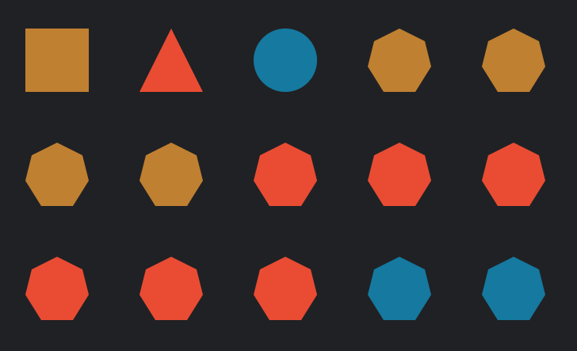

# Workshop: JavaScript in the browser

## Part 1: Practical

Scenario: You’re building an app where people can create geometric shapes
in different colors and make them move with simple animations. The
structure of the HTML and CSS has been written by another developer.

[Get the starter files here](https://www.github.com/Birkbeck2/web-development/tree/main/workshops/events/starter-files/). Be sure to download both `index.html` and `styles.css`.

Task: Your job is to add the JavaScript for interactivity. To do this, you will
need to write event listeners and JS functions to modify the HTML on user
input. Start by creating an external JS file and loading it into the HTML file.

Requirements: Please try to meet as many of these user requirements as you can.

1. When I click on a square, it rotates 45 degrees. When I click it again, it
   goes back.

   Hint: Check out the CSS class called `rotated-45` in `styles.css`.

2. When I click on a triangle, it skews. When I click it again, it goes back.

   Hint: Check out `skewed` in `styles.css`.

3. When I click on a circle, it gets a bit bigger. When I click it again, it
   goes back.

   Hint: See `magnified` in `styles.css`.

4. I can create a new shape by selecting one from the dropdown and submitting
   the form with the “Create” button. The new shape will appear as the last
   item in the gallery.

   Hint: If you are not sure where to start, try writing the steps out in
   English, using comments, before writing each step in code.

   Hint: Here are some of the main things you will need to put together:

     - listen for one thing (the `submit` event of the form)

     - prevent the default behavior for that event (browser refreshing the whole page)

     - get some data out of something else (the `value` attribute of the `select`
       element in the form)

     - perform actions on yet others (a newly created shape, and the shapes
       container)

## Part 2: Creative

Please choose one of the following options.

## Creative Option A: Challenges

Continue with the shapes page to meet some or all of these user needs:

1. I can specify the color when creating a new shape, using another dropdown.

   Hint: There’s another select element for colors, commented out in the HTML.

2. I can click on *any* of the shapes to trigger the transformations.

   Hint: This would require creating the same kind of event listener as you did
   for the initial three shapes, perhaps by putting that bit of code in
   a function and calling it when a new shape is created.

3. The new shapes I create have `role` and `aria-label` attributes like the
   first three shapes.

4. Each heptagon and star has its own transformation, applied and removed on click.

## Creative Option B: Open-ended

Make a simple webpage and experiment with different types of events, or
different ways of using JavaScript to create or modify page elements (like
`Element.innerHTML` with template literals).
