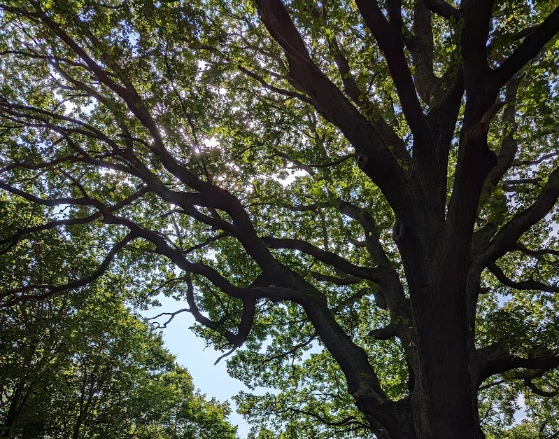
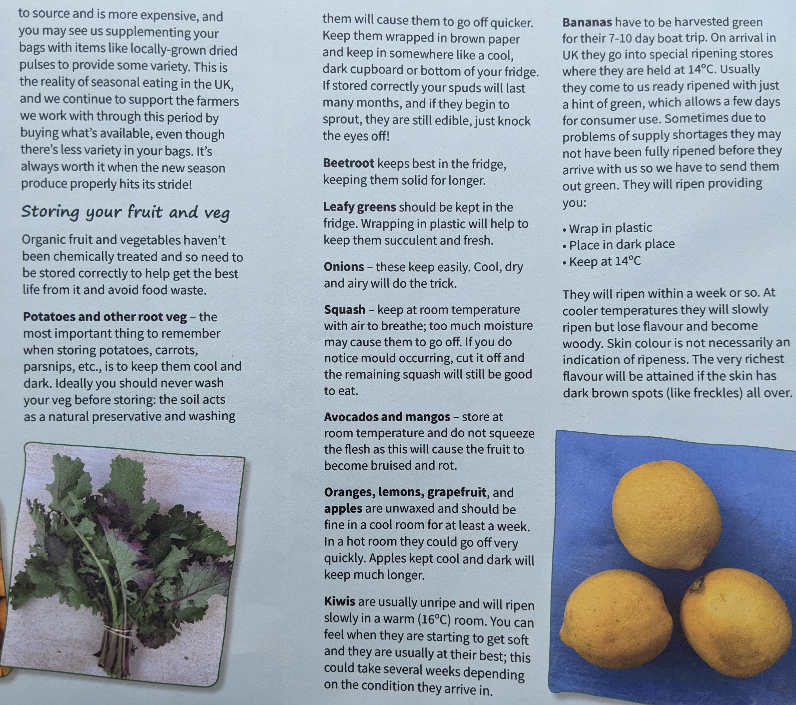

---

outline: [2, 4]

---

# Workshop: Reading and writing HTML

## Part 1: Practical

In the first part of the workshop, please work in a group to practice reading HTML
documents and noticing key aspects of their structure, and then mark up some
HTML as a group.

::: info
This part of the workshop is required as homework.
:::

### Setup

1. Find one or two other people and form a group of 2-3 students.

2. Create a repository using the same steps as in the markdown workshop.
   You only need one repository for the group. The link to create the GitHub
   repository is in today’s tile on Moodle.

3. Make sure everyone in the group has “Write” or higher access to the
   repository. You can share it with just your small group members or with the
   whole Canary group if you wish.

   ::: info
   [Managing teams and people with access to your
   repository](https://docs.github.com/en/repositories/managing-your-repositorys-settings-and-features/managing-repository-settings/managing-teams-and-people-with-access-to-your-repository)
   :::

4. Edit the `index.html` file in the repository and create a new `h2` section where
   you list the students in the group, so we know who should get credit.

5. Publish the site with GitHub Pages so that you can check the output while
   you work.

### Visualize an HTML document’s structure

6. Choose one of the HTML documents in the repository to analyze. Discuss
   how you might represent the structure visually with pen and paper or using
   a digital sketching app of your choice.

   Most websites have lots of nested div elements--you do not have to
   represent all these individually.

   ::: tip
   The task is not to draw what the rendered web page will look like,
   but to create a visualization of the structure of the HTML document.
   HTML is often diagrammed as a tree, but feel free to use another visual
   idea.
   :::

   Extra optional challenge: Can you come up with a way to
   represent any of these things visually on the elements 
   where they apply?

   * does the element take up space on the page or is it invisible?
   * is it semantic or presentational?
   * is it block or inline by default?
   * is it a landmark element?
   * is it focusable?

7. Draw a diagram to represent the HTML document.

8. Take a picture of your paper diagram, or export an image file of your
   digital diagram, and post it in the README file of your repository, with
   a heading or text that explains which file you analyzed.

### Mark up a text document as HTML

9. Staying in your group, choose a document to mark up from the plain text
   files provided in the repository. 

   Below are images of the documents as they appear in print or rendered in the browser. (Note that your HTML won’t look similar without CSS, and that’s OK.)

   

   *Crown copyright 2022*

   

   *Copyright OrganicLea 2022*

   Crossed-out elements are not in the provided text file--you can leave them out.

   

   

10. Mark up the document as HTML and save it in the root folder of the
    repository. Use a short name with keywords from the title, all
    lowercase, no spaces, just hyphens between words.

    ::: tip
    Want to check the rendering as you code? Try editing HTML in
    the browser inspector pane, then copy-pasting it to your file on
    GitHub to commit it.
    :::

11. Add a link to your page in the `index.html` file alongside the other
    pages.

## Part 2: Critical/Creative

This part is optional, and you have your choice of creative or critical prompts.

### Creative

Here are some ideas:

* Choose any real document you made in the past that is not yet in HTML,
and convert it into HTML.

* Take over one of the documents provided for diagramming and edit up the HTML to
your liking, and add styling if you like.

### Critical

For the critical options, please post responses in the Canary Discussion board
“Discuss and critique.”

Choose one of these prompts and write a paragraph or two responding to it:

* In “Developmental Sequence in Small Groups,” Bruce Tuckman says that groups of
people working together go through four stages: forming, storming, norming, and
performing. What does he mean by this, and do you find it convincing? How
does your past experience of working in groups confirm his findings or
cause you to question them?

* What is the open web, in your own words? Why does it matter?

* What are the practical effects of using semantic HTML?
