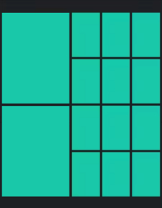
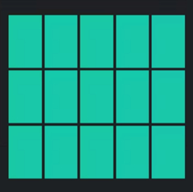
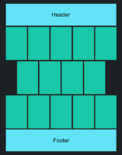

# Workshop: Responsive Web Design

## Flexbox and Grid.

1)	Select some of the provided workshop images which have been taken from this article on [jellyfish](https://publicdomainreview.org/collection/mayer-medusae/), enough to produce the following gallery style web pages.

2)	Considering the image below create an HTML page with the whole layout within a flexbox container, and 2 flexbox containers (one for each main row) each of which contains an image plus another (nested) flexbox container with 6 images. Create CSS for the mobile version (single images in a column). Then create media queries for the tablet version (one larger image above pairs of images, then repeat), and the desktop version (the layout in the picture).

3)	Considering the image below create an HTML page for a grid layout with one grid container and 15 grid items. Create CSS for the mobile version (single images in a column). Then create media queries for the tablet version (rows of 3 images), and the desktop version (the layout in the picture).

4)	Optional extra exercise: Considering the image below create an HTML page for a flexbox layout with a header area, some images in rows, and a footer area. Hint: you could consider the top two rows of images as one flexbox, and the bottom row as another flexbox (but this is not the only way to do this). Create CSS for a mobile version (single images in a column). Then create media queries for the tablet version (rows of 3 images with two images as the last row above the footer), and the desktop version (the layout in the picture).

