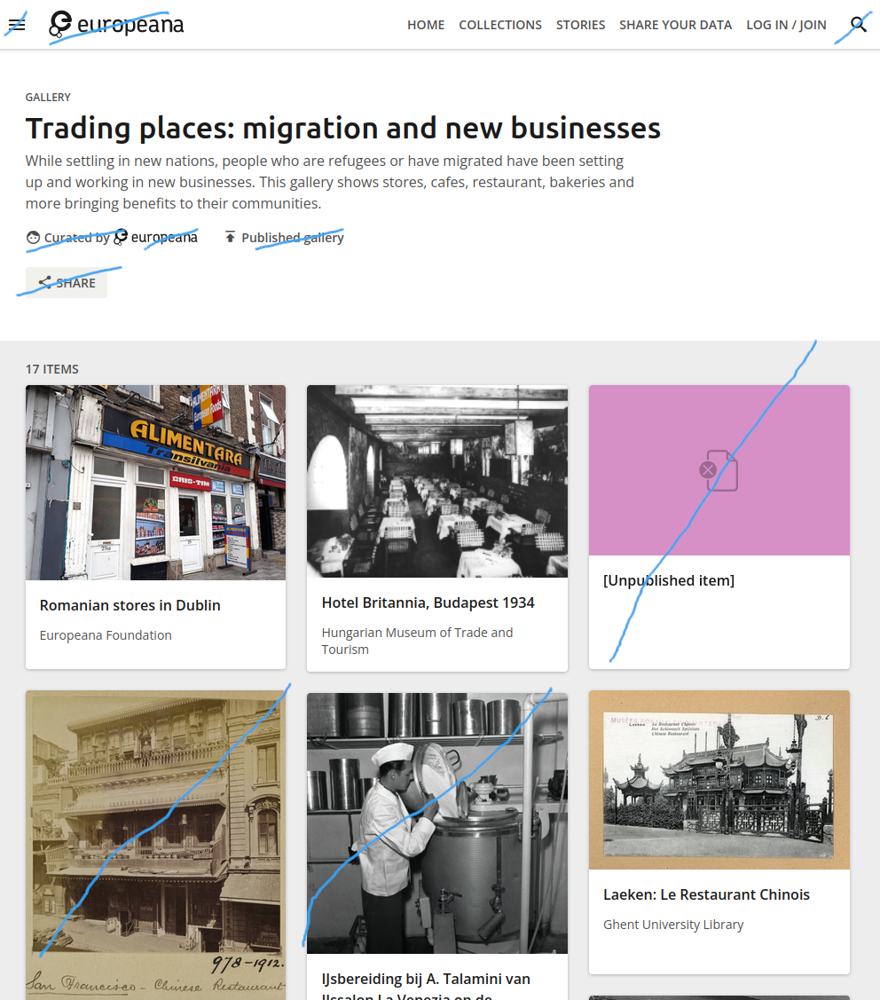
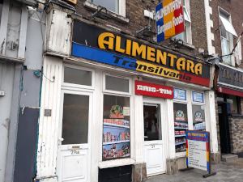
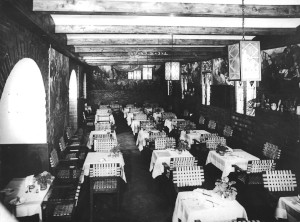
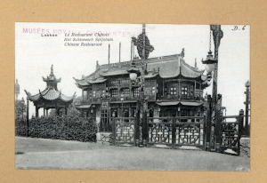

# Workshop on Semantic HTML

In this workshop you have a chance to practice marking up a full web page
with a nav bar, pictures, and external links.

## Mark up a webpage containing a photo gallery

1. Take a look at the screenshots below. They show a [gallery webpage of
   migration-related
   photos](https://www.europeana.eu/en/galleries/9044-trading-places-migration-and-new-businesses)
   on the Europeana digital archive website.

    

    

2. Imagine you are a developer for Europeana. You have been asked
   to write HTML for this page, including everything except the elements
   that are crossed out. (They’re someone else’s job :grin:)

   Note! This is an HTML workshops, so you do *not* have to create the
   styling you see in the screenshot with CSS, since we have not
   officially started CSS yet. This means the images will not be in
   a gallery grid but one after the other, vertically, the fonts and
   colors won’t look right, and other things. That’s OK.

   Here are the images and text you will need.

    

    

    

    ```
    Trading places: migration and new businesses | Europeana

    Home

    Collections

    Stories

    Share your data

    Log in / Join

    Gallery

    Trading places: migration and new businesses

    While settling in new nations, people who are refugees
    or have migrated have been setting up and working in new businesses. 
    This gallery shows stores, cafes, restaurant, bakeries and more bringing
    benefits to their communities.

    17 items
    
    Romanian stores in Dublin

    Europeana Foundation

    Hotel Britannia, Budapest 1934

    Hungarian Museum of Trade and Tourism

    Laeken: Le Restaurant Chinois

    Ghent University Library

    Our mission

    Europeana empowers the cultural heritage sector in its digital 
    transformation. We develop expertise, tools and policies to embrace 
    digital change and encourage partnerships that foster innovation.
    ```

3. Please make sure to meet these requirements with your HTML markup.

    - Name the file `trading-places.html`.

    - Write a “valid” HTML document according to the HTML standard,
      with all minimally required elements and attributes. (The autograder
      in the homework submission will test for this and show you any
      errors so you can fix them and then re-upload.)

    - Give each region of the webpage the proper semantic element.

    - Include alt text and dimensions with each image.

    - Organize the image files in a subfolder and access them with
      relative paths.

    - Form the paths for all files and folders with best practices in mind.

    - Create links for each of the things on the page that you think should be
      clickable. You can use the example URL “https://example.org” as
      a destination, or you can find the real links [on the live
      site](https://www.europeana.eu/en/galleries/9044-trading-places-migration-and-new-businesses)
      if it is available.

    - In general, use semantic and presentational elements where they are
      called for.

## Create a form

4. Make a contact form with fields for first name, last name, email
   address, and message.

5. Please make sure your form meets these requirements:

    - Specify a form method.

    - Choose the appropriate element for each input type.

    - Make sure each input has a label that is fully accessible.

    - Make sure the submit button submits the form.

## Start working on the HTML for your portfolio website (if time)

6. If you have time, start working on the HTML for your website. Follow
   your own creative process, building on the site mapping and planning
   you did in the UX workshops. Some ideas:

   - For each page that you plan to have, make a list of the HTML elements that
     you want to use on that page.

   - Choose the simplest page on your website and try to write HTML for it.

   - Think if there are any user requirements that you don’t yet know how
     to meet in HTML. Do research to find the answer, or ask someone for
     help on where to look first.

## Image attributions

Romanian stores in Dublin - Europeana Foundation, Europe - CC BY-SA.
https://www.europeana.eu/item/2084002/contributions_aacb0a30_8ad9_0136_2c76_6eee0af61964

Hotel Britannia, Budapest 1934 - Hungarian Museum of Trade and Tourism, Hungary - CC BY-NC-ND.
https://www.europeana.eu/item/2048128/282047

Laeken: Le Restaurant Chinois - Ghent University Library, Belgium - CC BY-SA.
https://www.europeana.eu/item/9200229/BibliographicResource_3000135596468
